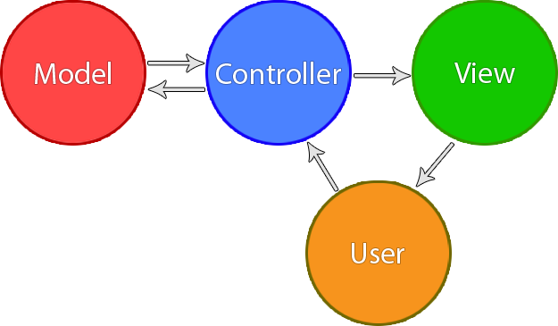

## Introduction

Model View Controller (MVC) is a very well established architecture that fulfills all of the goals pf good architecture. MVC is supported/encouraged within various other platforms and languages, including ASP.NET MVC, so it will follow you wherever you go.

MVC works by defining three different abstractions (Model, View, and Controller), allowing good separation of concern:

## Model

Model objects are the parts of the application that implement the logic for the application's data domain. Often, model objects retrieve and store model state in a database. For example, a Product object might retrieve information from a database, operate on it, and then write updated information back to a Products table in a SQL Server database.

In small applications, the model is often a conceptual separation instead of a physical one. For example, if the application only reads a dataset and sends it to the view, the application does not have a physical model layer and associated classes. In that case, the dataset takes on the role of a model object.

## View

Views are the components that display the application's user interface (UI). Typically, this UI is created from the model data. An example would be an edit view of a Products table that displays text boxes, drop-down lists, and checkboxes based on the current state of a Product object.

## Controller

Controllers are the components that handle user interaction, work with the model, and ultimately select a view to render that displays UI. In an MVC application, the view only displays information; the controller handles and responds to user input and interaction. For example, the controller handles query-string values, and passes these values to the model, which in turn might use these values to query the database.
