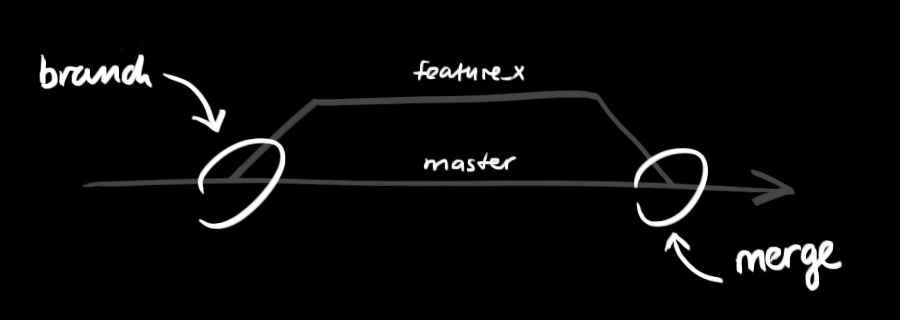
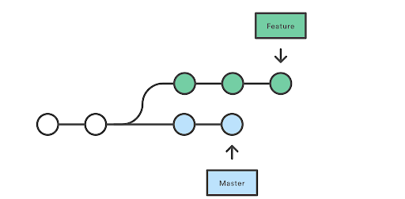

## Why

**In a collaborative environment, it is common for several developers to share and work on the same source code. While some developers will be fixing bugs, others will be implementing new features, etc. With so much going on, there needs to be a system in place for managing different versions of the same code base.**

**Branching allows each developer to branch out from the original code base and isolate their work from others. It also helps Git to easily merge versions later on.**

**What truly separates git from other VCS is the fact its distributed. Many of the prior VCSs like CVS and svn had branching but were centralized and couldn't be used offline.**

* <https://backlog.com/git-tutorial/using-branches/>

* <https://git-scm.com/book/en/v2/Git-Branching-Branches-in-a-Nutshell>

## What

**Feature branches:**

* Branches are used to develop features isolated from each other.

* The master branch is the "default" branch when you create a repository.

* We'll use other branches for development, and then merge those branches back to the master branch upon completion.

**In this diagram below, we have two separate branches.  Our Master Branch – which is our default branch – and our Feature branch.  So we have two isolated lines of development:**

By developing them in branches, it’s not only possible to work on both of them in parallel, but it also keeps the main master branch free from questionable code.

**Branching Steps:**
To create a branch locally

* You can create a branch locally as long as you have a cloned version of the repo.

  * From your terminal window, **list** the branches on  your repository.

    ``$ git branch``

    ``* master``

  This output indicates there is a single branch, the master and the asterisk indicates it is currently active.

  * Create a new feature branch in the repository

    ``$ git branch <feature branch>``

  * Switch to the feature branch to work on it.

    ``$ git checkout <feature branch>``

  **You can list the branches again with the git branch command.**

  * Commit the change to the feature branch:

    ``$ git add .``

    ``$ git commit -m "adding a change from the feature branch``
  
  * Switch back to the master branch.

    ``$ git checkout master``

  * Push the feature branch to GitHub:
  
    ``$ git push origin <feature branch>``
  
  * View the **Source** page of your repository in GitHub. You should see both the master and the feature branch. When you select the feature branch, you see the **Source** page from that perspective. Select the feature branch to view its **Recent commits.**

## Switching Branches

The git checkout command allows you to switch branches by updating the files in your working tree to match the version stored in the branch that you wish to switch to.

You can think of it as a way of switching between different workspaces.

## Git Head

HEAD is used to represent the current snapshot of a branch

## Merging Branches

The merge command allows you to join two or more development histories together, such as a branch:

**Merges other branch into the current branch.**
  
``git merge branchName``

So if we want to merge our feature branch into our Master branch:

**Git checkout master** ←- we switch to our master branch
**Git pull** ←- make sure we have the latest version of master
**Git merge featureBranch** ←- merge featureBranch into Master branch

## Git Documentation

<https://git-scm.com/book/en/v2>

## How

**Let’s say you’ve been given the task of creating a new feature for an app.  Instead of making a bunch of commits to our master branch and seeing if the new feature works or not, we can create a new branch (or development history) and see if the feature works there.  If the feature doesn’t work, no harm no foul.  If it does, we can eventually merge that branch into the master branch.  Here we have avoided tainting our master branches timeline with mistakes.**

**Show an example of switching between 2 different branches and how each has differences that can eventually be merged.**

## Exercise

* **Interactive Tutorial:**
  * <https://www.katacoda.com/courses/git> <--- Complete scenarios 4

  * **Topics covered in this tutorial**
    * git checkout, Undoing changes - git reset, HEAD, git reset --hard, git revert; branching, merging, deleting branches.

## Quiz

<https://drive.google.com/open?id=1itA3HIuUttogt_VvPS_b-mai8rLI50SBhxKQLY7IzkM>
