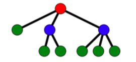
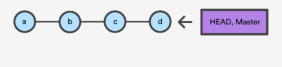
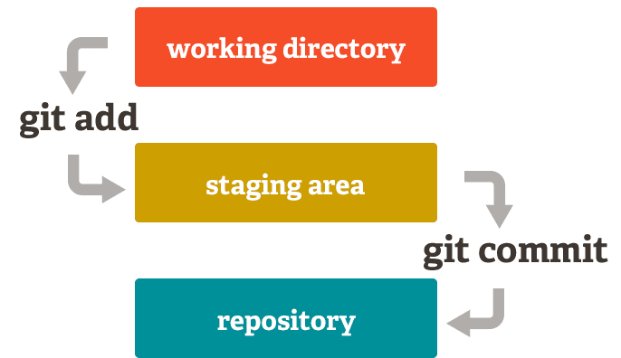

# Intro to Git

## Why

We cover Git because it is a Distributed Version Control System.  Distributed means there is no central server required, so work can be done “Offline” simultaneously with someone else also working offline.  In the past, with traditional Centralized Version Controls Systems, two people editing a file was very difficult and sometimes whomever saved the file last would overwrite someone else's work.

[Git was created by Linus Torvalds in 2005 for development of the Linux kernel](https://www.linuxjournal.com/content/git-origin-story), with other kernel developers contributing to its initial development and is a free and open-source software.

## What

**Version Control** is a means for managing your source code.

Version Control allows you to:

* Access previous versions of your code (History of content changes)
* Have multiple working copies of your code
* Backing up your code is now trivial
* Share your work with other people easily and facilitates collaborative changes to files

Version Control Systems are usually represented with a tree data structure

## Git

  A **distributed version-control system (DVCS)** for tracking changes in source code during software development. It is designed for coordinating work among programmers, but it can be used to track changes in any set of files.

## Git != GitHub

So while Git is a tool to manage your source code history, GitHub is a hosting service for Git repositories.

Git is the tool, GitHub is a service for projects that use Git .

GitHub is where our Remote repository will live.  Our computer is where our Local repository will live.  Once we have our project in a working state, we can push what’s in our Local repository to our Remote repository.

## Making Commits

The traditional software expression of "saving" is synonymous with the Git term "committing". **A commit is the Git equivalent of a "save"**.

The **git commit** command captures a snapshot of the project's currently staged changes.

Each circle in the above diagram is a commit – a **snapshot** of the project.

## Remote Repositories

Versions of your project that are hosted on the Internet or network somewhere (like GitHub!). Collaborating with others involves managing these remote repositories and pushing and pulling data to and from them when you need to share work.  

With Remote Repositories we usually use these git commands:

* git clone : puts a copy of the remote repository on our machine

* git push :  after we worked on the local version of the repository, we can push those changes to the remote

* git pull : pulls the latest version of the remote repository to our machine.  We use this after we have already cloned a copy of the remote repository to our local machine because someone else may have updated the remote in the meantime.  So we want to make sure we have the most up to date version

## Staging With Git Add

* **Git add <`FileName`>** - add a specific file to the staging area.

* **Git add .** - add all modified files to the staging area. The period is what chooses all the files.

  The **git add** command adds a change in the working directory to the **staging area**. It tells Git that you want to include updates to a particular file in the next commit. However, git add doesn't really affect the repository in any significant way—changes are not actually recorded until you run git commit.

  

## Moreover on Staging

  Stage lets you group related changes into highly focused snapshots before actually committing it to the project history. This means you can make all sorts of edits to unrelated files, then go back and split them up into logical commits by adding related changes to the stage and commit them piece-by-piece.

## Workflow

Developing a project revolves around the basic **edit/stage/commit** pattern.

* Edit
  * Do work(edit your files in the working directory)
* Stage
  * When you're ready to save a copy of the current state of the project, you can stage all your changes with:
    * **git add .**
* Commit
  * After you’re happy with the staged snapshot, you commit it to the project history with:
    * **git commit -m "a descriptive message"**
* **Send to GitHub (remote repository) - git push**
  * In addition to git add and git commit, a third command **git push** is essential for a complete collaborative Git workflow. **git push is utilized to send the committed changes to remote repositories for collaboration.** This enables other team members to access a set of saved changes.

---

## Basic Git commands

* **For Mac :** to show hidden files: cmd-shift-.

* **git init :** initializes a new repository in the current directory

* **git status :** The git status command displays the state of the working directory and the staging area. It lets you see which changes have been staged, which haven't, and which files aren't being tracked by Git

* **git add <`fileName`> :** stages a file so it is ready to commit

* **git add . :** stages all files in the directory so they are ready to commit

* **git commit -m “this is my first commit” :** commits the changes in the currently staged files and includes a message

* **git push :** tells git that you're ready to push your local changes. Just tell git where to push
  * git push <`remote-name`> <`branch-name`>
  * git push -u origin master

* **git clone <`remote url`> :** copy a remote repository to your local machine.  Very collaborative  

* **git branch :** lists the branches in the repository

* **git branch <`name`> :** creates a new branch

* **git checkout <`name`> :** switches to a specific branch

* **git checkout –b <`name`> :** creates a new branch, and switches to that branch at the same time

* **git merge <`name`> :** merges a specific branch into the current branch

* **git pull :** downloads content from a remote repository and immediately update the local repository to match that content.

* **git log :** display our commit history

---

## Git Documentaion

<https://git-scm.com/book/en/v2>

## Exercise

* **Online Tutorial: Complete scenarios 1-3:**
  * <https://www.katacoda.com/courses/git>

  * **Topics covered in the tutorial:**
    * git init, git status, untracked files, git add, git commit -m “message”, gitignore, git diff, git diff staged, git log

* **Work with git on a simple pizza delivery algorithm file that covers the steps involved with ordering a pizza, and show how cool git can be with backing up our work.**

**Includes**
Create a repos folder, create a GitHub repository, clone it down, add a text file to the repository with a Pizza Delivery algorithm, git status/git add/git commit as we add to the text file, git push to their GitHub repo, get familiar with the command prompt / terminal.

**Quiz:**

* <https://drive.google.com/open?id=1mGH6yY3e34WcX4ei4OLPRgzdwB5nISNBURlsKY1xhyI>
