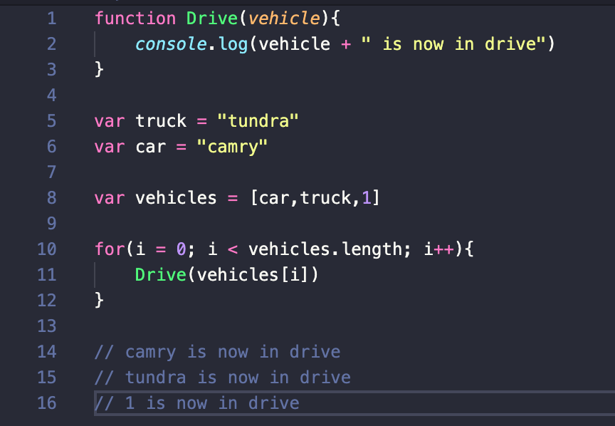
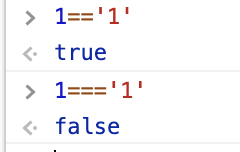
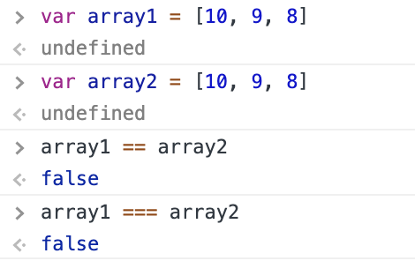
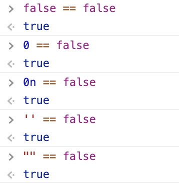
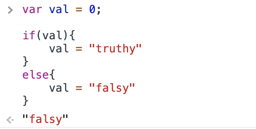

## Why

[JavaScript is a programming language](https://www.fraudlabspro.com/resources/tutorials/add-fraudlabs-pro-agent-javascript-bigcommerce/) used primarily by Web browsers to create a dynamic and interactive experience for the user. Most of the functions and applications that make the Internet indispensable to modern life are coded in some form of JavaScript. In the past, Web pages were static, offering little user interaction beyond clicking links and loading new pages. For the first time, JavaScript enabled animation, adaptive content and form validation on the page. Initially, JavaScript compatibility was a major issue across the most common platforms.

Some of the dynamic website enhancements performed by JavaScript are:

* Autocomplete

* Loading new content or data onto the page without reloading the page

* Rollover effects and dropdown menus

* Animating page elements such as fading, resizing or relocating

* Playing [audio and video](https://www.bigcommerce.com/blog/product-video-marketing-examples/)

* Validating input from Webforms

* Repairing browser compatibility issues

Duck typing gives a programmer the ability to not worry about the type of an object rather perform the required operations. This allows a programmer to save time and optimize performance. It's been said that duck typing in general cuts down development time. There's less boilerplate code and gives programmers flexibility.

---

## What

Javascript is an Interpreted language, meaning the interpreter assigns variables a type based on the variable’s value at run-time.

Moreover, Interpreted languages are languages that are not compiled but are parsed on the fly.  Javascript and other languages fall into this category as you don’t have a compile step prior to running.  Simply save the script and refresh.

When referring to Duck Typing, many use the saying,

“If it quacks like a duck, walks like a duck...it’s a duck”

This can initially be confusing...

Duck Typing refers to a duck test program. You will test something, if it goes like a duck, and fly like a duck, it is a duck. If a method responds to any given object call, it passes the **“Duck Test”.**

**Duck Typing** is a feature in javascript where the variable attempts to behave in the manner it is used.  So if it’s used as a string it’s a string etc.

In C# or other statically typed languages, passing methods into objects is deemed suitable based on its type. With duck typing, however, objects are determined whether or not suitable based on what it does, not what it is. It doesn’t matter the type if both objects do the same thing or better yet, have the same capabilities. If the method responds to the object call, basically as long as the object responds **TYPE DOESN’T MATTER!**

Duck Typing is polymorphism w/o hierarchy, dynamic dispatch w/o inheritance hierarchy, and no explicit interfaces. Essentially checking for capability, not compatibility.  

Duck Typing is used in many programming languages, for example,  Ruby, Python,.. and it is really useful but sometimes it creates unwanted acts in application because the rules of  Duck Typing are too simple and can result in wrong conclusions. You can understand this warning more in examples.

---

## How

1. There is a function called drive

2. There is an array called vehicles that contains two strings and an integer.

3. The for-loop calls the Drive function for the array.

4. No matter the type, each element of the array is in Drive.

* In c# if you have two different objects

  * var car = new Car();

  * var truck = new Truck();

* We have a method

  * Drive()

* That method would need to be defined to work with both type Car and type Truck

  * car.Drive();

  * truck.Drive();

***Truthy - Falsy and ===:***

As well as a type, each value also has an inherent boolean value, generally known as either truthy or falsy.

***Javascript utilizes a couple of options for checking equality:***

* == the “Double equal” operator or the **“Abstract operator”**

  * Also known as **“Loose Equality”** - Using **Type Coercion** the == takes both values and converts them to the same type before performing the comparison

* === the “triple equal” operator or the **“identity operator”**

  * Does not use coercion.  Both of the items being compared must have the same value && type to return true

For Example:

We cannot do this with arrays however, even if 2 arrays have the same exact contents, both arrays point to different places in memory:

***Truthy and Falsy:***

In Javascript, all values have an inherit boolean value assigned to it:

According to the Mozilla Developer Network, a falsy value is a value that is considered false when encountered in a Boolean context.  We can use these in if statements.

***Falsy Examples: The following all have boolean value of false***

* false

* 0

* 0n - BigInt

* “”, ‘’, ``

* null

* undefined

* NaN - Not a number

**For Example:**

`All other values are considered “truthy”`

`All of the following expressions evaluate to true in Javascript:`

* 1 == true

* [] == false

* [] !== false

* "false" == true

* undefined == false

* undefined !== false

And we can use truthy/falsy when we evaluate conditions.

For example with this if statement:  Since 0 if falsy, the if statement changed the value of the variable val to “falsy”

---

## Exercise

1. Create a function named TakeOff that accepts a parameter such as an array of flying objects.

2. Create 5 variables
    * plane = “plane”,
    * sevenFiftySeven = “757”,
    * Drone = “drone”
    * shellPlane = null,
    * nothing = “”
    * and add them to an array named flyingObjects

3. Create a function named TakeOff that accepts an array parameter
    * Use a for loop to traverse through the array
    * Use a if else statement to evaluate each variable in the flyingObjects array as a boolean - this will use truthy falsy
    * If the variable evaluates to true, use console.log() to print that the variable “is preparing for takeoff!”
    * Else - the variable “cannot fly”

4. Call the TakeOff function and pass in flyingObjects as a parameter

## Quiz

<https://docs.google.com/forms/d/1hWZ0IcZU8u_pdKd4_y2IlqzCQFO0hGOxpZpB0PvYN9I/edit>