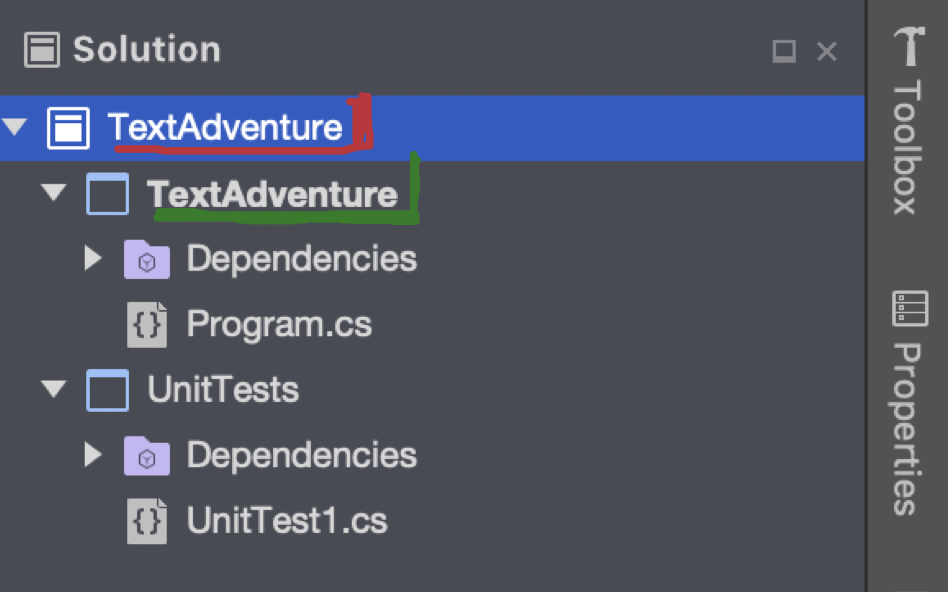
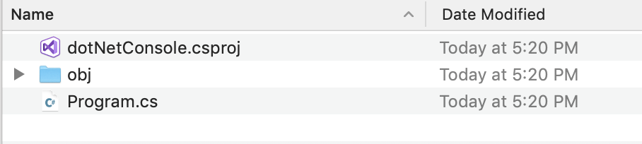
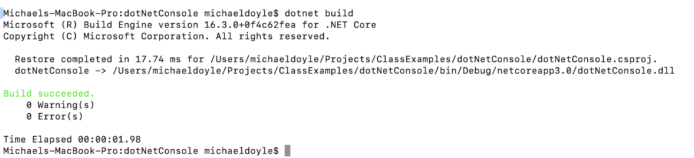
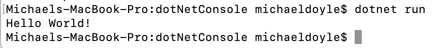

## Why

The .NET Core **command-line interface (CLI)** is a new cross-platform toolchain for developing .NET applications. The CLI is a foundation upon which higher-level tools, such as Integrated Development Environments (IDEs), editors, and build orchestrators, can rest.  

We teach this topic because it is important to know that we can do everything that our IDE (Visual Studio) does on the command line.  So if we are experiencing issues with Visual Studio, we can always fall back on our command line skills.

## What

**Solution file (.sln)** - a solution is a container used by Visual Studio to organize one or more related projects.  When you open a solution in Visual Studio, it automatically loads all the projects the solution contains

**Project file (.csproj)** – contains all the source code that are compiled.  It also contains compiler settings and other configuration files

* **Structure:**
  * Solution files contain
    * Project files which contain
      * source code

## Command Line: (Command Prompt/Terminal)

* **dotnet command:** dotnet is a tool for managing .NET source code and binaries. It exposes commands that perform specific tasks, such as dotnet build and dotnet run.

* **dotnet new:** Creates a new project, configuration file, or solution based on the specified template.
  * Example: dotnet new console <--- creates a new console application for us

* **dotnet build:** Builds a project and all of its dependencies.
  * Example: dotnet build

* **dotnet run:** Runs source code without any explicit compile or launch commands.
  * The dotnet run command provides a convenient option to run your application from the source code with one command. It's useful for fast iterative development from the command line. The command depends on the dotnet build command to build the code.
    * Example: dotnet run

* **dotnet sln:** The dotnet sln command provides a convenient way to add, remove, and list projects in a solution file.
  * Example: dotnet new sln

* **dotnet test:** The dotnet test command is used to execute unit tests in a given project. The dotnet test command launches the test runner console application specified for a project. The test runner executes the tests defined for a unit test framework (for example, MSTest, NUnit, or xUnit) and reports the success or failure of each test. If all tests are successful, the test runner returns 0 as an exit code; otherwise if any test fails, it returns 1.
  * If not project path is specified it defaults to the current directory
    * Example: dotnet test ~/projects/test1/test1.csproj

* **dotnet clean:** The dotnet clean command cleans the output of the previous build. It's implemented as an MSBuild target, so the project is evaluated when the command is run. Only the outputs created during the build are cleaned. Both intermediate (obj) and final output (bin) folders are cleaned.

## How

* michaeldoyle$ mkdir dotNetConsole
* michaeldoyle$ cd dotNetConsole
* michaeldoyle$ dotnet new console
  * The template "Console Application" was created successfully.

  * Processing post-creation actions...
  * Running 'dotnet restore' on /Users/michaeldoyle/Projects/ClassExamples/dotNetConsole/dotNetConsole.csproj...
  * Restore completed in 69.52 ms for /Users/michaeldoyle/Projects/ClassExamples/dotNetConsole/dotNetConsole.csproj.

  * Restore succeeded.

___
**Dotnet build**

___
Dotnet run

## Exercise

1. Use the command line / terminal to create a new folder named HelloWorld
2. Cd into that folder
3. Create another folder named HelloWorld
4. Cd into that folder
5. Create a new console application from the command line / terminal
6. Build the application
7. Run the application
8. Open Program.cs in VS Code and change the message that will be printed to the console and save the file
9. Run the application again

## Quiz

<https://drive.google.com/open?id=1erIg7fWWXGWYoMqA5VjZiH_z_0jHErsbrnMJ2kLvviQ>

## Sources

* <https://docs.microsoft.com/en-us/dotnet/core/tools/dotnet-sln>
* <https://docs.microsoft.com/en-us/dotnet/core/tools/dotnet-sln>
* <https://docs.microsoft.com/en-us/visualstudio/msbuild/msbuild?view=vs-2019>
* <https://docs.microsoft.com/en-us/dotnet/core/tools/dotnet-clean>
