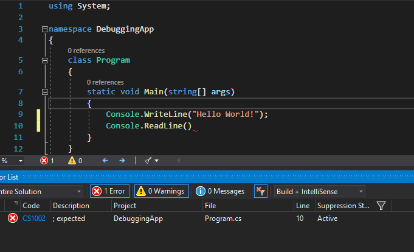
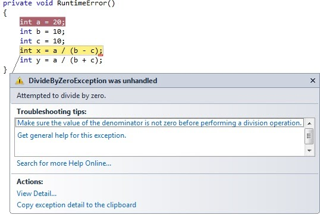
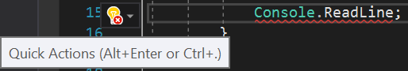

## Why

***EVERYBODY*** will eventually run into an error with their code. It will make you mad, sad, surprised; you might want to sit in a corner somewhere and cry for an hour. This is completely normal. That being said after we wipe the tears of our face; we can take some steps into actually figuring out where the error is and fix it! Generally speaking, there are 3 types of errors: ***Compile-time, Runtime, and Logical.*** Some will be easier to fix than others **BUT** they can all be fixed in some form or fashion.

The term debugging originated in 1945 when there was an incident at Harvard University. Computer scientists were working on Harvard’s Mark II calculator, they found a problem between points in a relay. It was a moth that had gotten into the relay! Grace Hopper, a U.S Navy Admiral added a caption into their logbook “First actual case of bug being found” and that was the first time anyone had used the word bug to describe a computer glitch. That’s where the term “Debugging” or removing bugs came from.

---

## What

So what does debugging look like today? Well, you probably won’t be pulling moths out of your computer hardware, but you never know. More often than not you **WILL** be inside Visual Studio or your preferred IDE and you will be running your program multiple times over. Modern IDEs give us a variety of tools to find and fix bugs in our code.

The first thing we will talk about is the infamous “Red Squiggles”, red wavy lines, or red hats. Whatever you call them, they’re annoying; but invaluable. The red lines are our first indicator that something is wrong in our code. They are accompanied by an error message that can be found on our Error List window. If your Error List window isn’t pulling up automatically, you can find it simply as follows: Visual Studio menu ribbon => View => Error List, or hotkey: ctrl + W, E for the default shortcuts. (Insert Mac Shortcut here: ) So now that we have our error list pulled up we can now see what VS is trying to tell us about our error.

This one is pretty obvious. We are missing a semicolon after the Console.ReadLine(). We can come to that conclusion a number of different ways. The first indication would be the red line next to the ReadLine(). We know that we end lines of code with a semicolon, but if you forgot that then we have another indicator. In the error list, it tells us that VS was expecting a semicolon on line 10. Pretty neat!

Let us hit the breaks briefly to talk about what we see in the error window. Starting with the far left:

* Code - Every error in C# has a unique identifier. This is what “Code” is referring to.

* Description - This is what the definition of “Code” is or the actual problem you're encountering

* Project - As our applications grow we can start adding in multiple projects to our solution, such as web services or unit test projects. This will tell us in which project that one error is in.

* File - An even more granular pinpointing of where the actual problem is, such as in Program.cs or User.cs.

* Line - Exactly which line in our file the error is. The most granular form of error location.

* Suppression State - For now you won’t need to worry about that but just remember it has to do with a tool called Code Analyze. It can have 2 states: Active or Suppressed.

---

***Error Types***

Aforementioned, there are generally 3 types of errors:

* Compile Time

* Runtime

* Logical

Each of these errors has its own characteristics and solution.

**Compile Time:**

A compile-time error is an error that shows up when you’re writing code, it will be accompanied by a red squiggly and show up in the error window. In languages that are compiled, like C#, the compiler will validate the program in many ways. It will only accept programs that have the correct syntax. Programs must use the object model correctly. Every object must exist.

These are the easiest to fix since VS will give you indications of your error as well as try to give solutions to the problem. The example is the one shown above. Your program will not start/build until these are debugged.

**Runtime Errors:**

Have you ever been using your favorite app and it completely crashes on you? If so, you have experienced a Runtime error! A Runtime error is an error that occurs while your application is running. While in debug mode this will show up as an exception:

An exception is an error that occurs during runtime of a program, or “when you are using the app”. This is a terrible situation as a developer if an end user experiences this. This means that while using **YOUR** app it crashed and what they were doing is lost. Now you will need to create a hotfix and then push the fixes to the repo. Then it will be tested to ensure your hotfix didn’t break something else in the app. This must be avoided at all costs as it can be quite a long process. You will need to have adequate exception handling in place! An example of exception handling is using a try catch block. This will be covered or (has been covered hopefully by now) in another lesson.

Here is a list of common Exceptions:

* System.NullReferenceException

* System.StackOverflowException

* System.IndexOutOfRangeException

* System.IO.FileNotFoundException

* System.Net.WebException

* System.OutOfMemoryException

* System.InvalidCastException

* System.InvalidOperationException

This link will take you to an expanded list and give a description of each:
<https://raygun.com/blog/common-c-sharp-exceptions/>

**Logical errors:**

A logical error is an error that while you can still run your program and it will not crash, you won’t be getting the results you might expect. One example of this may be like asking for the user’s name and age to print it in the console and the program saying “Hello 24, you are John Smith years old!”. No, the app didn’t crash but we got funky results.

---

## How

1. Don’t panic!

2. Truly the best solution is prevention. If you have the right amount of code coverage with unit tests you will most likely not run into many Runtime errors. This is possibly the most important step, ***WRITE GOOD TESTS.***

3. If the issue is a red squiggly, or (compile-time error) read the error on the Error Window list. Hover over the error in code and press ctrl + period or alt + enter. For mac (option + return). This is a shortcut for “Quick actions”. Quick actions will try to fix the error for you.

4. If the error is an exception, or (Runtime error), the Exception Window shows a good description of what went wrong so read that first, if you are unable to figure it out, a quick google search will definitely help out. Just like with compile-time errors, someone has most likely gotten your exception before.

5. Set a breakpoint close to where the exception is being thrown (Runtime error), like at the start of a method call. You will want to step through the application using the step into button at the top. (Live demo on breakpoints here)

6. Don’t start changing a bunch of code, try changing one or two lines and see if that fixed the problem.

7. Try reading your code like plain English (out loud), if it doesn’t make sense, you may have figured out where your problem lies (Google the phrase “Rubber Ducking”).

8. ***WHITEBOARD IT!*** If you are struggling with a logical error try getting a couple of your teammates and explain what you’re trying to accomplish on the whiteboard. A lot of logical problems stem from being in front of a computer screen for hours writing code, this will break that, and probably shine a light on the issue. Plus, you will be interacting with your team which is a plus.

9. Reduce State.  The less state that is possible the fewer things that can go wrong.  Remember the single responsibility principle.  Take components out of the equation to ensure that they aren’t related to the issue.

10. Think ahead and put logging statements throughout your code.  Consider what you might want to know if something was going arie with the method that you wrote. In production, you don’t have the opportunity to attach a debugger.  So the log is all you have to go on.  Remember, logic errors don’t produce exceptions so you’ll need to know the arguments and parameters in order to determine what’s going wrong.

11. Google your error message or word the search in a manner that will return results close to what you’re looking to do or accomplish. [stackoverflow](http://www.stackoverflow.com) is a good place to look for answers.

12. If all else fails, ask someone with more experience than you, such as a senior dev or tech lead on your team. Ask them only after you have utilized the above steps. It is **never** a bad thing to ask for help, but you do not want to waste someone's time asking a **simple** question you could have googled the answer to or figured out the answer to on your own.

---

## Exercise

Fork this exercise, Clone the project to your machine, and fix all the errors to make the program functional then run it to see if the program runs as expected, and then push to your GitHub. There will be compile-time, runtime, and logical errors.

***Good Luck!***

<https://github.com/CruzSanchez/ProblematicProblem>

## Quiz

<https://docs.google.com/forms/d/1_ruyl-I5VoGnFh0C9PH2KCq51spU6bacCSxk5j2R6do/edit>
