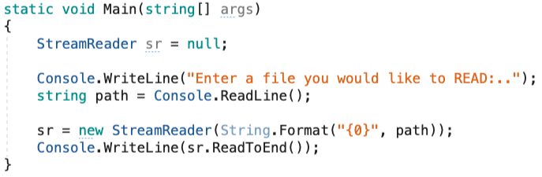
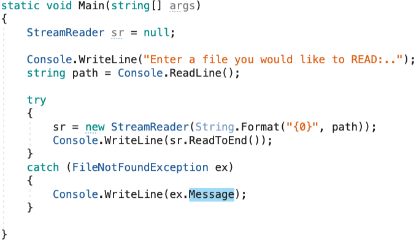
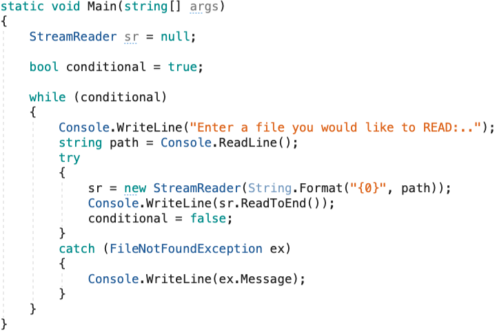
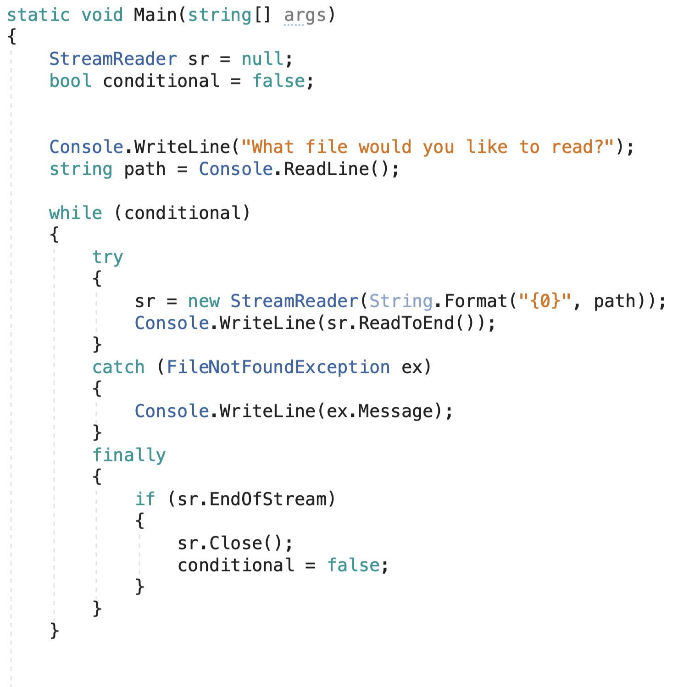

## Why

Software exception handling developed in Lisp in the 1960s and 1970s. This originated in LISP 1.5 (1962), where exceptions were caught by the ERRSET keyword, which returned NIL in case of an error, instead of terminating the program or entering the debugger.

Today, in C derived languages we use what is called “try-catch” to handle exceptions.

There is some overhead with throwing and catching exceptions, so just like the name implies it should be reserved for exceptional conditions that are not the norm.  If a test can be run to prevent the exception then that’s usually the best practice.  Typically, reserved for exceptional conditions like AccessDenied, ConnectionNotAvailable, etc that are not the norm for the application, the exception can be a very useful tool in your arsenal if used wisely.

---

## What

* A try block is used by C# programmers to partition code that might be affected by an exception.

* Associated catch blocks are used to handle any resulting exceptions.

* A finally block contains code that is run regardless of whether or not an exception is thrown in the try block, such as releasing resources that are allocated in the try block

* A try block requires one or more associated catch blocks, or a finally block, or both.

A try block without a catch or finally block will throw a compiler error

***Catch Blocks***

* A catch block can specify the type of exception to catch. The type specification is called an exception filter. The exception type should be derived from Exception.

* In general, do not specify Exception as the exception filter unless either you know how to handle all exceptions that might be thrown in the try block, or you have included a throw statement at the end of your catch block.

* Multiple catch blocks with different exception filters can be chained together. The catch blocks are evaluated from top to bottom in your code, but only one catch block is executed for each exception that is thrown. The first catch block that specifies the exact type or a base class of the thrown exception is executed. If no catch block specifies a matching exception filter, a catch block that does not have a filter is selected, if one is present in the statement. It is important to position catch blocks with the most specific (that is, the most derived) exception types first.

**You should catch exceptions when the following conditions are true:**

* You have a good understanding of why the exception might be thrown, and you can implement a specific recovery, such as prompting the user to enter a new file name when you catch a FileNotFoundException object.

* You can create and throw a new, more specific exception.

* You want to partially handle an exception before passing it on for additional handling. In the following example, a catch block is used to add an entry to the error log before re-throwing the exception.

***Finally Blocks:***

* A finally block enables you to clean up actions that are performed in a try block. If present, the finally block executes last, after the try block and any matched catch block. A finally block always runs, regardless of whether an exception is thrown or a catch block matching the exception type is found.

---

## How

For real world examples, we have a program set to read a file called DataFile.txt based on the file path we provide, however when we try to give a path, if the path is incorrect then a FileNotFoundException is thrown.
To handle this exception, we can use a try catch!

And then by placing our try catch in a While loop we can continue asking for the right file until the correct file path is specified

Afterwards we can add a finally block to execute a block of code regardless if an Exception was thrown or not, or regardless of the type of Exception:

---

## Exercise

<https://github.com/nrice41593/ExceptionHandlingExercise>

## Quiz

<https://docs.google.com/forms/d/1FQY7Wt5dRQUdS31cC_sAp8ov8aKvPYRNkAOKMGYmSho/edit>
