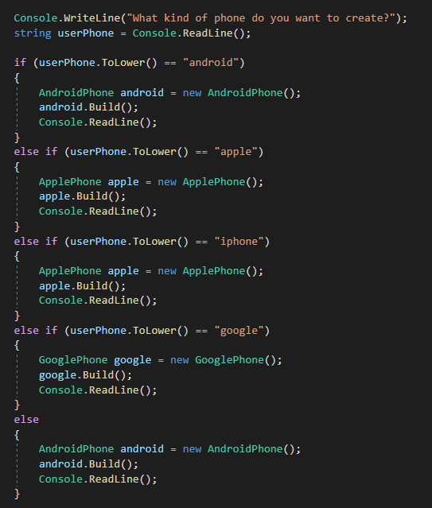
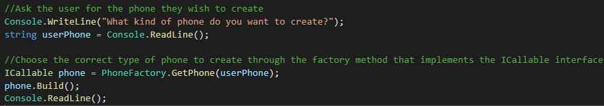
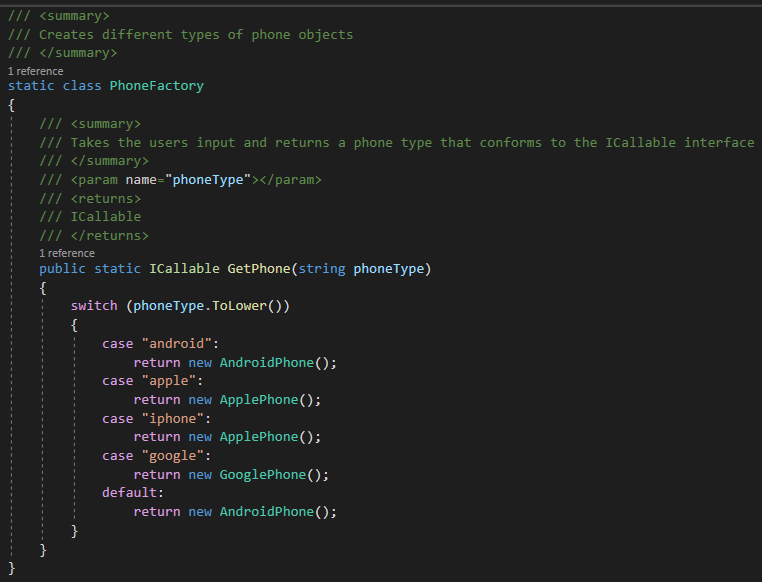
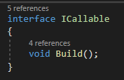
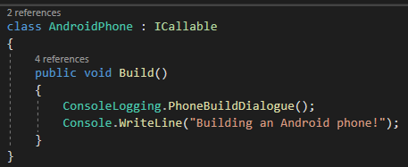

## Why

In programming, it is highly desired to have a loosely coupled application. One way to achieve this is by implementing the Factory Design Pattern. This provides flexibility, readability, and it provides easily maintainable code by keeping it DRY. When you repeat yourself in code you are creating brittle code or “easily broken code”. You are setting yourself up to make numerous changes across your application, which is not only a bad practice but will cause many headaches down the line. Not repeating yourself also makes your code more readable, in 6 months or a year you will be able to come right back into the code and see what is happening very easily.

Factory Design Pattern is one of the 23 design patterns developed by the Gang of Four. The Gang of Four are authors of the book, “Design Patterns: Elements of Reusable Object-Oriented Software”. The four authors are Erich Gamma, Richard Helm, Ralph Johnson, and John Vlissides.

---

## What

The Factory Design Pattern is a programming concept that allows one class, separate to the main program or “client”, to create new objects. By using the factory pattern to encapsulate object creation, you have one location to make changes to the way objects are instantiated. The way this is accomplished is by programming to an interface or an abstract class. When we program to an interface or ABS class, the program doesn’t care what type of object we wish to create as long as it implements the interface or inherits from the ABS class.

This is a perfect example of polymorphism, one of the four principles of object-oriented programming. In this example, we are programming to an interface that has two classes that implement an interface. When the client class calls for one of the two classes to be instantiated we can create either one, at runtime, as an interface variable since they both conform to the interface. This works for replacing the interface with an ABS class as well but you will need to override the method definitions with the override keyword.

Now when would we want to use this pattern? Simply put, you will need to think about using Factory Pattern when a class cannot figure out what type of object to create; “Conditional Object Creation” or ITTT “If This, Then That”, when a class uses its subclass to specify which object to create, or when you need to localize the knowledge of object creation.

---

## How

The way we implement the factory pattern is first by recognizing where an interface can be created and then programming to that interface. In this example, we will use phones and phone creations.

Our program takes a user’s input and based on what they pass through the console, we will create that phone. Now let us assume we do something similar to this in our code 5 more times. Anytime we need to make a change to the way apple phones are created we will need to make that change 10 times potentially. That is **NOT** an efficient coding practice! So let's take this logic and store it into a static class as a static method, that way anytime we need to utilize this logic we can call the static method and pass the information we need as parameters.

We can see that this version is **MUCH** cleaner yet still has the same functionality and is 10X more maintainable. We introduced a few new things here that we need to talk about, the first thing is ICallable. This is the interface that our Phone classes implement. Since they all implement the interface we can return any new instance of a Phone class as an ICallable variable. The PhoneFactory has a static method called GetPhone(). Inside this method is a switch statement that uses the parameters to create the correct phone. Here are the example pictures:

---

## Exercise

Example exercise for reference: [FactoryPatternExample](https://github.com/CruzSanchez/FactoryPattern.git)

Create a console app that utilizes factory pattern by taking a user’s input of how many tires are on a vehicle and based on their input, creates that type of vehicle. Complete this using both an interface and an abstract class. You must have at least 3 subclasses. For instance, if I type 4 into the console, the program would create a car or truck, or if someone types 2 it would create a motorcycle.

Feel free to use something other than vehicles if you want to be creative, but the other constraints still apply!

**Bonus:**

You can take this a step further by creating an abstract factory or IFactory interface that the Concrete Factories inherit/implement and the subclass factories pump out (instantiate) Concrete Products (vehicles, phones, etc). This can be viewed more in-depth here: <https://www.c-sharpcorner.com/article/factory-method-design-pattern-in-c-sharp/>

---

## Quiz

<https://docs.google.com/forms/d/10ZxHm96jGXSbQYv6a31j1n31Z_ACQf8EtCA7Bkqowsw/edit>

## Sources

<https://garywoodfine.com/factory-method-design-pattern/>
