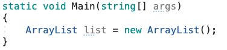
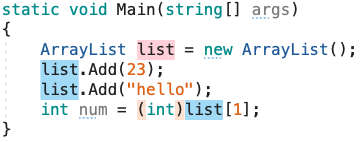
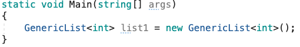

## Why

***Background and history***

* **1999** Initial research, design and planning

  *[.NET/C# Generics History: Some Photos From Feb 1999](https://blogs.msdn.microsoft.com/dsyme/2011/03/15/netc-generics-history-some-photos-from-feb-1999/)

* 1999 First ‘white paper’ published

  *[More C#/.NET Generics Research Project History – The MSR white paper](https://blogs.msdn.microsoft.com/dsyme/2012/07/05/more-c-net-generics-research-project-history-the-msr-white-paper-from-mid-1999/)

  * [MSR White Paper: Proposed Extensions to COM+ VOS (Draft) (pdf)](https://msdnshared.blob.core.windows.net/media/MSDNBlogsFS/prod.evol.blogs.msdn.com/CommunityServer.Components.PostAttachments/00/10/32/72/38/Ext-VOS.pdf)

* 2001 C# Language Design Specification created

  * [Some History: 2001 “GC#” (Generic C#) research project draft](https://blogs.msdn.microsoft.com/dsyme/2012/06/19/some-history-2001-gc-research-project-draft-from-the-msr-cambridge-team/)

  * [MSR - .NET Generics Research Project - Generic C# Specification (pdf)](https://msdnshared.blob.core.windows.net/media/MSDNBlogsFS/prod.evol.blogs.msdn.com/CommunityServer.Components.PostAttachments/00/10/32/17/02/GCSharp-new-v16-12-Dec-2001-redist.pdf)

* 2001 Research paper published

  * [Design and Implementation of Generics for the .NET CLR (pdf)](https://www.microsoft.com/en-us/research/publication/design-and-implementation-of-generics-for-the-net-common-language-runtime/)

* 2004 Work completed and all bugs fixed
  * [https://blogs.msdn.microsoft.com/dsyme/2012/06/26/some-more-netc-generics-research-project-history/](https://blogs.msdn.microsoft.com/dsyme/2012/06/26/some-more-netc-generics-research-project-history/)

C# Generics were introduced to .NET Framework in 2.0. Generics bring the concept of type parameters to the .NET Framework, which makes it possible to design classes and methods that defer the specification of one or more types until the class or method is declared and instantiated by client code.

Another Reason why Generics are extremely important is because of what Generics replaced, things like ArrayList, which you should never use:



One of the more popular problems with ArrayLists is that can store multiple data types while not offering any compile-time errors. Looking at this, we know this will fail at runtime. This code should never be used.



***Which is why we use Generics, which are strongly typed.***

---

## What

***Generic Type Paramaters***

* In a generic type or method definition, a type parameter is a placeholder for a specific type that a client specifies when they create an instance of the generic type.

* A generic class, such as **GenericList`<T>`**, cannot be used as-is because it is not really a type; it is more like a blueprint for a type. To use **GenericList`<T>`**, client code must declare and instantiate a constructed type by specifying a type argument inside the angle brackets.

* The type argument for this particular class can be any type recognized by the compiler. Any number of constructed type instances can be created, each one using a different type argument, as follows:



* **Type Parameter Naming Guidelines**

  * **Do** name generic type parameters with descriptive names, unless a single letter name is completely self-explanatory and descriptive name would not add value.

  * **Consider** using T as the type parameter names for types with one single letter type parameter.

  * **Do** prefix descriptive type parameter names with "T".

  * **Consider** indicating constraints placed on a type parameter in the name of the parameter. For example, a parameter constrained to ISession may be called TSession.f

***Constraints on Type Parameters***

* Constraints inform the compiler about the capabilities a type argument must-have. Without any constraints, the type argument could be any type. The compiler can only assume the members of System.Object, which is the ultimate base class for any .NET type.

* If the client code tries to instantiate your class by using a type that is not allowed by a constraint, the result is a compile-time error. Constraints are specified by using the where contextual keyword.

* There are seven types of Constraints:

  * Where T : struct = The type argument must be a non-nullable value type.

  * Where T : class = The type argument must be a reference typeWhere T : notnull = The type argument must be a non-nullable type.

  * Where T : unmanaged = The type argument must be a non-nullable unmanaged type.

  * Where T : new() = The type argument must have a public parameterless constructor.

  * Where T : `<base class name>` = The type argument must be or derive from the specified base class.

  * Where T : `<interface name>` = The type argument must be or implement the specified interface.

  * Where T : U = The type argument supplied for T must be or derive from the argument supplied for U.

***Lists***

A list is similar to an array, except the elements in a list can be inserted and removed dynamically.

The C# generic collection List`<T>` class requires all elements be of the same type T.

**List`<T>` properties and methods include:**

* Count A property that gets the number of elements contained in the list.

* Item[int i] Gets or sets the element in the list at the index i. Item is the indexer and is not required when accessing an element. You only need to use the brackets [] and the index value inside the brackets.

* Add(T t) Adds an element t to the end of the list.

* RemoveAt(int index) Removes the element at the specified position (index) from the list.

* Sort() Sorts elements in the list.

***Dictionaries***

A dictionary is a collection of unique key/value pairs where a key is used to access the corresponding value. Dictionaries are used in database indexing, cache implementations, and so on.

The C# generic collection Dictionary`<K, V>` class requires all key/value pairs be of the same type `K, V.` Duplicate keys are not permitted to ensure that every key/value pair is unique.

**Dictionary`<K, V>` properties include:**

* Count - Gets the number of key/value pairs contained in the dictionary.

* Item[K key] - Gets the value associated with the specified key in the dictionary. Item is the indexer and is not required when accessing an element. You only need to use the brackets [] and key value.

* Keys - Gets an indexed collection containing only the keys contained in the dictionary.

**Dictionary`<K, V>` methods include:**

* Add(K key, V value) - Adds the key, value pair to the dictionary.

* Remove(K key) - Removes the key/value pair related to the specified key from the dictionary.

***Sorted Lists***

A sorted list is a collection of key/value pairs that are sorted by key. A key can be used to access its corresponding value in the sorted list.

The C# generic collection SortedList`<K, V>` class requires all element key/value pairs to be of the same type K, V. Duplicate keys are not permitted, which ensures that every key/value pair is unique.

**SortedList`<K, V>` properties include:**

* Count - Gets the number of key/value pairs contained in the sorted list.

* Item[K key] - Gets or sets the value associated with the specified key contained in the sorted list. Item is the indexer and is not required when accessing an element. You only need to use the brackets [] and the key, value.

* Keys - Gets a sorted and indexed collection containing only the keys in the sorted list.

**SortedList`<K, V>` methods include:**

* Add(K key, V value) - Adds an element with a specific key, value pair into the sorted list.

* Remove(K key) - Removes the element with the specific key, value pair associated with the specified key from the sorted list.

Differences between a sorted list and Dictionary:

<https://stackoverflow.com/questions/935621/whats-the-difference-between-sortedlist-and-sorteddictionary>

---

## How

Our Swap method will work only for integer parameters. If we want to use it for other types, for example, doubles or strings, we have to overload it for all the types we want to use it with. Besides a lot of code repetition, it becomes harder to manage the code because changes in one method mean changes to all of the overloaded methods.

Generics provide a flexible mechanism to define a generic type.

```csharp
public static void Swap<T>(ref T a, ref T b)
{
  T temp = a;
  a = b;
  b = temp;
}
```

In the code above, T is the name of our generic type. We can name it anything we want, but T is a commonly used name. Our Swap method now takes two parameters of type T. We also use the T type for our temp variable that is used to swap the values.

Note the brackets in the syntax `<T>`, which are used to define a generic type.

---

## Exercise

* First, fork the repository from <https://github.com/nrice41593/GenericsExercise>

* Add me as a collaborator

* Then, clone the repo onto your personal machine and follow the instructions in the Project.

* When finished, push your project back up to GitHub and mark the assignment as complete in Google Classroom.

## Quiz

<https://docs.google.com/forms/d/1B35FftvCfOo5TVcYphxBhOq72Dr10IoeUs2aooG2RbE/edit>
