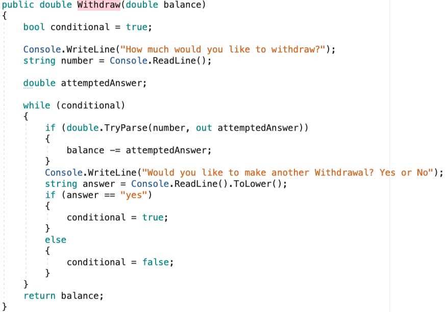

## Why

In real life, we need to do some repetitive tasks, and doing the same task, again and again, can be hectic. There are situations where you have to write a statement or execute a set of logic multiple times or display a message with a slight variation in numbers. So, obviously doing this form of work manually will be time-consuming and extremely in-effective.

---

## What

There are **4 loops** that you mainly see: while, do-while, for, & foreach.

* The **“while”** loop executes a statement or a block of statements while a specified Boolean expression evaluates to true. Because that expression is evaluated before each execution of the loop, a while loop executes zero or more times. This differs from the while loop, which executes one or more times. Use a while loop if you need to execute some code until something happens.

```csharp
while (true)
{
    // do something here until condition is false
}
```

* The **“do-while”** loop executes a statement or a block of statements while a specified Boolean expression evaluates to true. Because that expression is evaluated after each execution of the loop, a do-while loop is guaranteed to execute at least one or more times. Use a do-while loop if you need to execute some code at least once, then continue execution until something happens.

```csharp
var i = 0;
do
{
    // Increment i each execution
    i++;
} while (i < 10)
```

* The “**for**” loop executes a statement or a block of statements while a specified Boolean expression evaluates to true. Use a for loop if you need to execute some code a specific number of times. A “for” loop contains 5 parts: the for keyword, the initializer (int i = 0;), the conditional (i < 10;), the iterator (i++;), and the body ( { } )


All three main sections are optional. The body of the loop is either a statement or a block of statements. Below let’s look at the way a for loop executes.


First, our for loop starts at our initializer int i = 0; declaring i to be 0


Then, it checks to see if i is less than 10, which will return true or false.


If the conditional returns true, then the code within our body executes, here the body contains an Add method that is adding the value of i to the list called listOfNumbers.


Finally our for loop iterates our variable by 1, and then checks to see if i is still less than 10. If it returns true, our for loop executes again.


Pay attention to how our program never goes back to our initializer again.

* A “**foreach**” loop executes a statement or a block of statements for each element in an instance of the type that implements the System.Collections.IEnumerable;
In other words, A “**foreach**” loop generally is used to iterate through collections such as Arrays, Lists, or enums. Use a foreach loop if you need to execute some code on each element in a collection of elements.

---

## How





---

## Exercise

* First, fork the repository from <https://github.com/nrice41593/IterationStatementsProject>

* Add me as a collaborator

* Then, clone the repo onto your personal machine and follow the instructions in the Project.

* When finished, push your project back up to GitHub and mark the assignment as complete in Google Classroom.  When the students finish, their code should look like:

## Quizzes

<https://docs.google.com/forms/d/18PDJeTkvzT1_fjx2rBUXt5le2WQ9eBQBAk7JTIwE9x4/edit>
