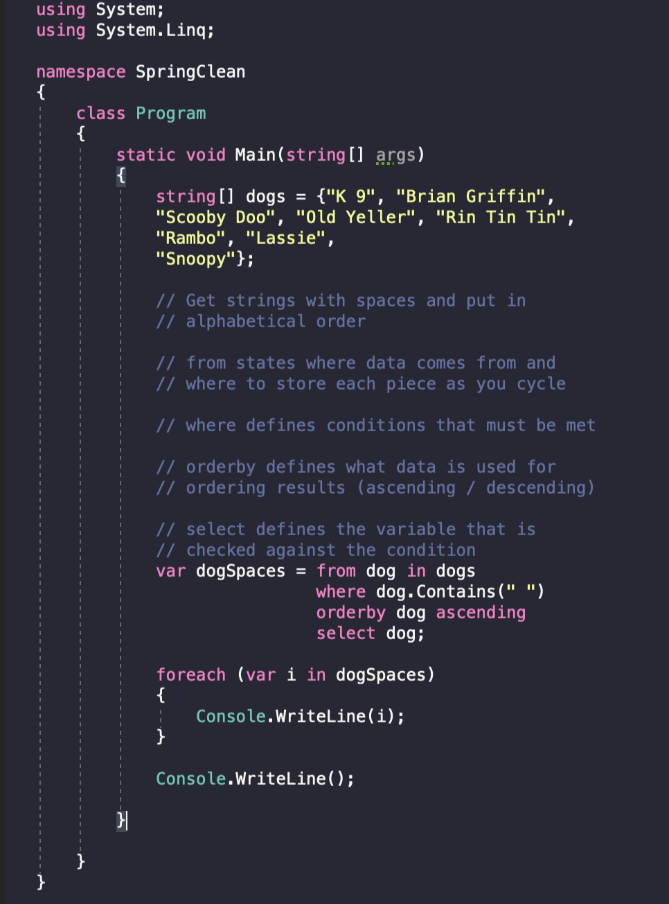

## Why

* The main reason for creating LINQ is, before LINQ, we used for loops, foreach loops, and delegates to travel or search a collection to find a specific object. The disadvantage of using loops for finding an object is the need to write huge amounts of code to find an object, which is more time-consuming and makes your program less readable. Therefore LINQ was introduced and it performs the same operation in fewer lines and makes your code more readable and also you can use the same code in other programs.

* LINQ is a more simple, well-ordered, and high-level language than SQL.

* LINQ extends the IEnumerable `<T>` interface so it can be used with arrays and collections.

* With the help of LINQ, you can easily work with any type of data source like XML, SQL, Entities, objects, etc. A single query can work with any type of database, there is no need to learn different types of languages.

* LINQ supports query expression, Implicitly typed variables, Object and collection initializers, Anonymous types, Extension Methods, and Lambda expressions.

---

## What

***L.I.N.Q.- Language Integrated Query***

LINQ is used for querying data. Notice that I used the generic term “data” and didn’t indicate what type of data. That’s because LINQ can be used to query many different types of data, including relational, XML, and even objects. Another way to describe LINQ is that it is programming language syntax that is used to query data.


Aforementioned above, System.Linq extends the IEnumerable interface. That tells us that we can utilize Linq to query anything that conforms to that interface in C# such as arrays and lists.

Sometimes when we are working with a query expression, we require a variable that can store the result of the sub-expression in order to reuse it in the upcoming clause. This type of facility is provided by the `Let` keyword. The `let` keyword allows you to create a range variable and initialized with the result of the query expression and then you are allowed to use that variable with the upcoming clause in the same query. When you initialize a range variable with one value after that you are not allowed to store another value in the range variable.

---

## How

***(Query/Syntax)***



Query syntax has a very distinctive syntactical style. Due to its unique format, query syntax is very memorable and somewhat iconic as it's often what people envision when thinking of LINQ. You might find similarities with this and SQL.

---

***Using System.Linq;***

This is essential when using LINQ. Both query syntax and method syntax require it.
Advantages of Query Syntax

* The MSDN documentation says that "many people find query syntax simpler and easier to read.

* Query syntax can be more compact since the variables created have a scope that spans the whole statement, vs. method syntax where variables need to be re-declared for each method call.

***(Method Syntax)***


LINQ method syntax can do everything that query syntax can do, and more. It's just a different way to format the instructions.

Advantages of Method Syntax:
Most people prefer method syntax over query syntax...

* Query syntax is automatically converted to method syntax at compile-time

* Not all LINQ methods can be utilized with query syntax

* Method syntax is stylistically more similar to other C# code

Here is a brief list of the most common methods that are used in Linq:

* Where()

* Select()

* OrderBy()

* Sum()

* Average()

* Min()

* Max()

* Take()

* Append()

Note that you can string multiple methods together.

Another component Linq is the Lambda expression. Lambda expressions in C# are used like anonymous functions(a method without a name), with the difference that in Lambda expressions you don’t need to specify the type of the value that you input thus making it more flexible to use.

The ‘=>’ is the lambda operator which is used in all lambda expressions. The Lambda expression is divided into two parts, the left side is the input and the right is the expression.

The Lambda Expressions can be of two types:

1. Expression Lambda: Consists of the input and the expression. ```input => expression;```

2. Statement Lambda: Consists of the input and a set of statements to be executed. ```input => {statements};```

Example to find number divisible by 3: ```numbers.Where(x => (x % 3) == 0)```

---

## Exercise

(Using Query Syntax)

1. Create an array of cars.

2. Select all of the cars that contain a particular letter of your choosing.

3. Print out the array in descending order.

(Using Method Syntax)

1. Create a list of video games.

2. List games by the length of the game name.

3. Order by length.

4. Use the lambda expression in this exercise as well.

GitHub Exercise (do this after the above work): <https://github.com/CruzSanchez/LinqExercise>

1. ***Fork*** this repo

2. Clone it to your local machine

3. Complete the tasks

4. Make commits and push back to your remote repo on Github!
