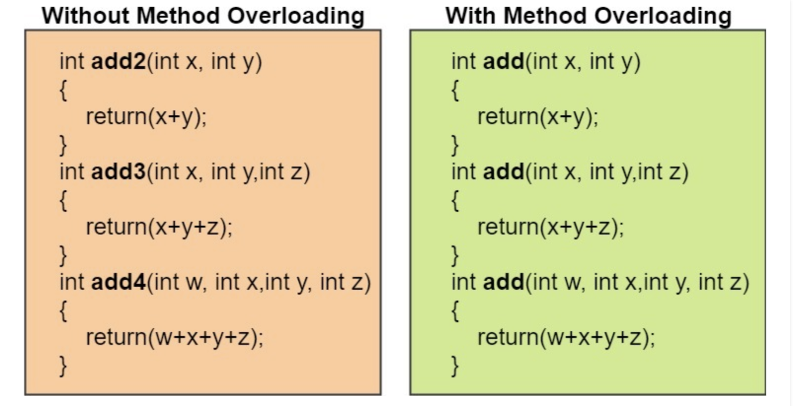
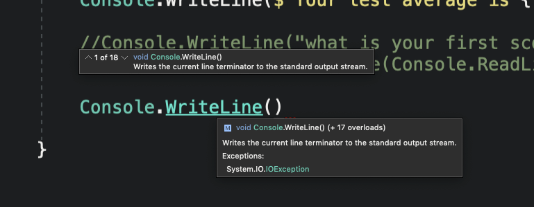
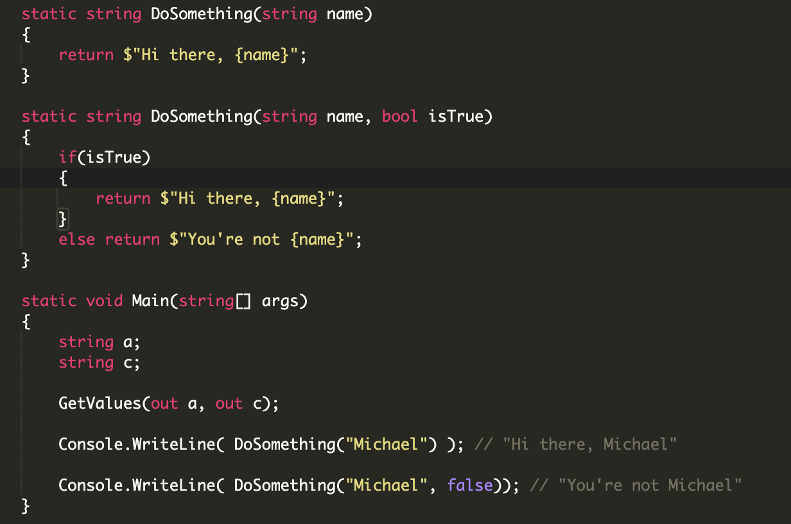

## Why

Did you know that two methods can share a name? They can’t however, have the same signature. A **signature** is essentially methods having the same method name, and the same return type, and the same order of parameters that get passed in.

**Method overloading** gained popularity out of pure necessity. Instead of creating methods that are very closely related in terms of functionality and creating similar names, method overloading allows us to share the original name and make minor adjustments as needed.

In short, Method Overloading allows us to use a method for different situations.

## What

Method overloading is when multiple methods have the same name, but different parameters.

* Recap:
  * When a method is called, the arguments are the data you pass into the method's parameters.

  * **A parameter** is variable in the declaration of the function / method. The argument is the actual value of this variable that gets passed to function.

Method Overloading allows methods of the same name to happily co-exist in the same program, providing their parameters differ in number, data type, or both number and data types - a process known as method resolution.

* Where a parameter represents the same value as that in another method, the parameters should have the same name.

* Parameters with the same name should appear in the same position in each method’s parameter list.

* You should not use ref or out modifiers to overload methods.

* You cannot overload method declarations that differ only by return type.

The following declaration results in an error:

* int PrintName(int a) { }

* float PrintName(int b) { }

* double PrintName(int c) { }

It is useful to create overloaded methods when the tasks they perform are similar, yet subtly different.



## How

```csharp
void Print(int a)
{
 Console.WriteLine("Value: " + a);
}
```

The + operator is used to concatenate values. In this case, the value of a is joined to the text "Value: ".

This method accepts an integer argument only.
Overloading it will make it available for other types, such as double:

```csharp
void Print(double a)
{
 Console.WriteLine("Value: "+a);
}
```

Now, the same **Print** method name will work for both integers and doubles.

Here we can see in Visual Studio, that when we write the Console.WriteLine() method, it shows us that there are 18 overloads of this method.



Example of Method Overloading: Same Method, different parameters



## Exercises

1. Create a method named Add, that accepts two integers and returns the sum of those two integers

2. Now create an overload of the Add method to account for being able to add two decimals together

3. Now create an overload of the Add method that returns a string and accepts 3 parameters: 2 integers and 1 boolean.
  
* If the boolean parameter is equal to true, the Add method will return the sum of the 2 numbers plus the word “dollars” at the end of the string.

* You must also account for the appropriate grammar of the string - so it can’t be “1 dollars”

  * For example:

    * "5 dollars

    * "1 dollar"

    * "16 dollars"

## Quiz

<https://docs.google.com/forms/d/1SXcfv6iqgmjgfMvGuyEFafIjy59k8uDJomJVRgYCveU/edit>
