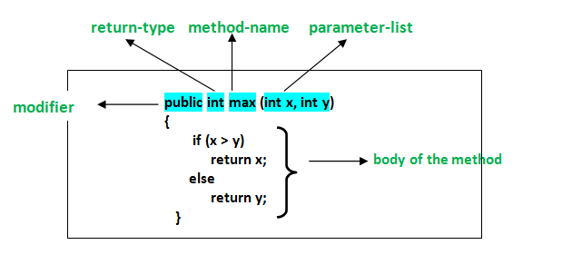
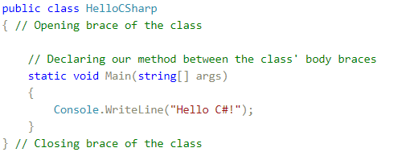
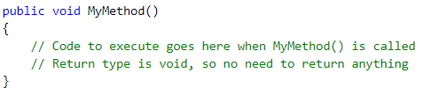
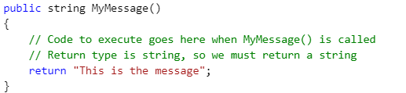
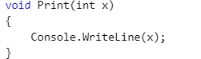
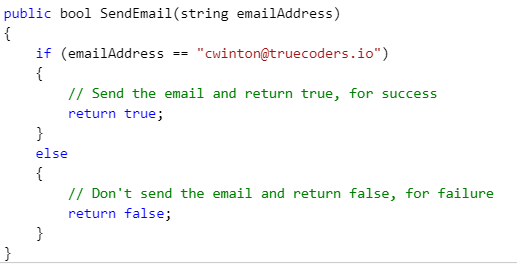
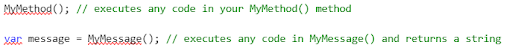
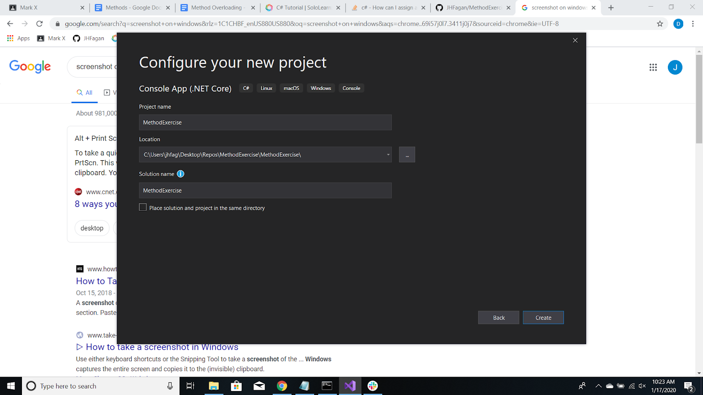

## Why

Methods have many advantages over writing code with functional programming ideals , including:

* Reusable code.
* Easy to test.
* Modifications to a method do not affect the calling program.
* One method can accept many different inputs.

**Subroutines in Programming:**

To solve certain, complex tasks - we apply a concept from ‘The Art of War,' “divide and conquer”. According to this principle, the problem we solve must be divided into smaller subproblems. Separately they are ***well defined and easily resolved*** compared to the whole problem at hand. By finding solutions for all the small problems we solve the complex one.

Using the same analogy, whenever we write a program we aim to solve a particular problem. To do it in an efficient and “easy-to-make” way we separate the given task into smaller tasks, then develop solutions for them and put them together into one program. Those smaller tasks we call subroutines.

In some other programming languages subroutines can be named as **functions** or **procedures**.

* Better structured program
* More readable code
* Avoid duplicated code
* Create reusable code

## What

**Fundamentals:**

A method, or function, helps you separate your code into modules that perform a given task... You execute this code by calling the Method. In C# a method consists of a few things.

* Modifiers: an optional list of keywords that give certain qualities to the method
  * And defines the scope and visibility
* Return Type: the type returned by the method, or void when not returning anything
* Name: a descriptive method name
  * The PascalCase rule must be applied
* Parameters: an optional list of parameters to be passed into the method
* Scope: the block of code to be executed when the method is called

Here’s a description of the syntax required for creating a method:

**To use a method, you need to:**

* Define the method.
* Call the method.

## How

Declaring Methods - In the C# language, a method can be declared only between the opening "{" and the closing "}" brackets of a class.

**Access Modifiers:**

In C# there are four access modifiers: public, private, protected and internal. The access modifiers can be used only in front of the following elements of the class: class declaration, fields, properties and methods.

* Public
  * this element can be accessed from every class, no matter from the current project
* Private
  * cannot be accessed from any other class, except the class which it is defined in.
* Internal
  * used to limit the access to the elements of the class only to files from the same assembly
* Protected
  * The type or member can be accessed only by code in the same class, or in a class that is derived from that class.

**Return Keyword:**
The return statement terminates the execution of the method in which it appears and returns control to the calling method. It can also return an optional value. If the method is a void type, the return statement can be omitted.

Both of these are actually shown below, in each individual method.

**Return Types**
The return type is void. You can think of void as similar to null. It's a keyword that represents the absence of a return type.

**Here's a public method with a string return type:**

**Paramaters:**

Method declarations can define multiple parameters to work with.

Below, we have a method called SendEmail. The return type is bool, in this case, if the email was sent with success. The method has one parameter: string emailAddress.

**Calling Methods:**

## Exercises

**Creating your project-Windows:**

**Step 1:** Write a c# program that makes takes user input and creates an adlib story.
Ask the user for things like a name, color, an animal, etc. Make up a story and be creative.

* Hint:
  * Use Console.ReadLine() to take user input and store the input into a variable.
  * For example:
    * Ask the user “What is your name?”
    * Store the input

Record user input, for each of these. Combine all answers for a fun, short story.

* Hint:
  * The final result will print something like this:
    * Name: Michael
    * Favorite Color: Blue
    * Favorite Animal: Walrus
    * Favorite Band: The Beatles

Extra points - turn the answers into a fun short story!

**Step 2:**
Write different methods that use each math operator, but allows you to plug in different integers.

Calling the different methods would look like:

* Sum(2,4) would return 6
* Multiply(10,2) would return 20

Challenge mode. Change the functions to use the params keyword to support a range of arguments.

* Sum (2,4) would return 6
* Sum(2,4,6) would return 12.
* Sum(1,1,1,1,1) would return 5

This way we could plug in multiple different values, and the method we write will still calculate it correctly, we could add, subtract, ect - as many values as we want.

## Quiz

<https://docs.google.com/forms/d/1tGKGaZO-ziGsFeBC-jOXtquOLXc2RXvdzF8jG_22K1U/edit>
