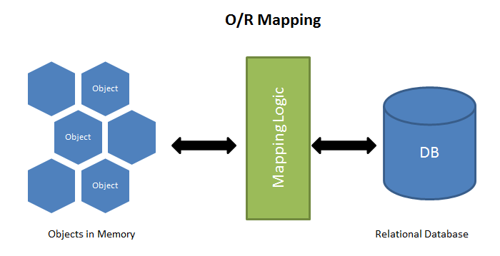
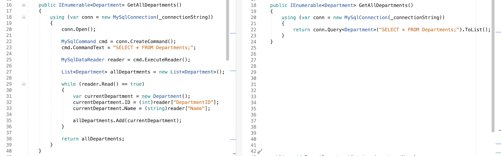
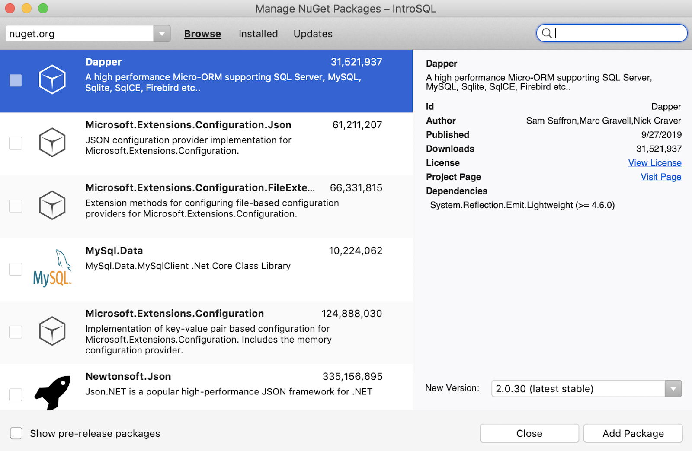
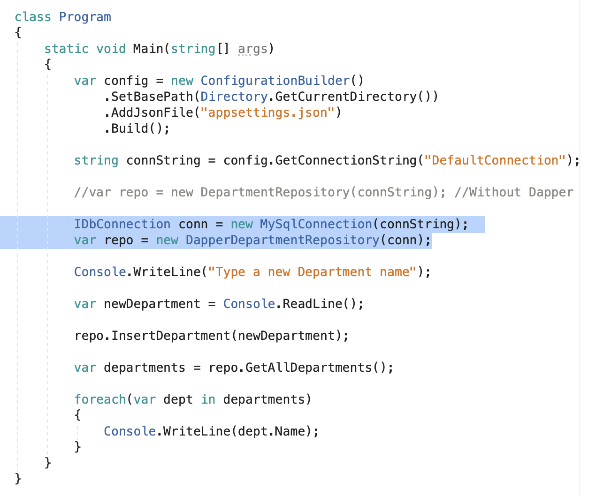

## Why

Programmers would prefer to exercise their creative muscles rather than type and retype data access and parameterized queries over and over. Enter Object Relational Mappers (ORM).

**ORMs** are the plumbers of the programming world. They help get data out of and back into databases from our data models. Additionally, ORM's like **Dapper** will handle parameterizing your SQL statements for you and make it very easy to fire a SQL query against database and get the result mapped to C# domain class.

---

## What

***ORM - Object Relational Mapper:***

An Object Relational Mapper is a software abstractor that is used to access a relational database from an object-oriented language



***Dapper:***

[dapper](https://github.com/StackExchange/Dapper) is a .NET compatible, NuGet library ORM that you can add into your project that will extend your IDbConnection interface.

Dapper has no DB specific implementation details; it works across SQLite, Oracle, MySQL, PostgreSQL, and SQL Server, to name a few.

Dapper adds a variety of things to the IDbConnection interface, but mostly you'll interact with Query and Execute:

Here is a side by side comparison of just using MySqlConnection vs using Dapper:

You might notice how much code is reduced by using the Dapper implementation



***Query Method:***

The Dapper Query is designed for any database reads, like SELECT.

Query returns an IEnumerable<`T`>, so a select statement will return one T for each record in the database.

***Execute Method:***

The Dapper Execute is designed for any database writes, like **INSERT, UPDATE, and DELETE.**

Execute only returns the number of records affected, so it can be ignored if you aren't interested in the affected records.

***Moreover:***

The Dapper framework actually extends the **IDbConnection** interface available under the System.Data namespace. It has many extension methods for data access and mapping the result to a C# type (domain objects) defined under the SqlMapper class found under Dapper namespace. So, in order to use Dapper, first we need to declare an IDbConnection object and initialize it to a SqlConnection to connect the database.

---

## How

* Add the Dapper Nugget package



* Create a DapperDepartmentRepository

This Class will conform to the IDepartmentRepository interface

Create **`private readonly` IDbConnection _connection;**

* Configure the Constructor

```csharp
public class DapperDepartmentRepository : IDepartmentRepository
  {
      private readonly IDbConnection _connection;

      public DapperDepartmentRepository(IDbConnection connection)
      {
        _connection = connection;
      }
```

* Create GetAllDepartments Method

`Here, the conn.Query method is a Dapper method that executes our query and returns a value of type T.  T being whatever type we specify.  In our example, we will return an IEnumerable containing Department objects`

`And:`
In this instance we don’t need the using statement because by virtue of passing the connection in via the constructor you are stating the the user of the class is responsible for the connection management. When it exits this code block then it will Dispose of and Close the connection not to be reopened

```csharp
public IEnumerable<Department> GetAllDepartments()
  {
    return _connection.Query<Department>("SELECT * FROM Departments;").ToList();
  }
```


* Create InsertDepartment Method

`Here, the Execute method will execute a parameterized query for us.  @departmentName being the parameter in our query.  Like in previous lessons, the @departmentName value is ascertained from  the value of newDepartmentName`

```csharp
public void InsertDepartment(string departmentName)
  {
    _connection.Execute("INSERT INTO DEPARTMENTS (Name) VALUES (@departmentName);",
    new { departmentName = departmentName});
  }
```

* Finished DapperDepartmentRepository

```csharp
public class DapperDepartmentRepository : IDepartmentRepository
  {
    private readonly IDbConnection _connection;

    public DapperDepartmentRepository(IDbConnection connection)
    {
      _connection = connection;
    }

    public IEnumerable<Department> GetAllDepartments()
    {
      return _connection.Query<Department>("SELECT * FROM Departments;").ToList();
    }

    public void InsertDepartment(string departmentName)
    {
      _connection.Execute("INSERT INTO DEPARTMENTS (Name) VALUES (@departmentName);",
      new { departmentName = departmentName});
    }
  }
```

* Implement in Program.cs

Here we can just comment out the instantiation of DepartmentRepository and implement our new instance of the DapperDepartmentRepository as seen below:



***OR With IoC Container***


***For Teachers:***

<https://github.com/mvdoyle/IntroSQL>

---

## Exercise

**Open your BestBuyBestPractices application. Taking what we’ve learned in class, implement Dapper inside this application.**

* Add the Dapper Nuget package

* Create a DapperDepartmentRepository that conforms to the IDepartmentRepository interface

* Inside of the DapperDepartmentRepository:

  * Create a constructor

  * Create a GetDepartments method that utilizing Dapper

  * Create a CreateDepartment method utilizing Dapper

* Implement our new methods in the Main method of Program.cs

***Bonus: Create the UpdateDepartment method in the DapperDepartmentRepository class***

## Quiz

<https://forms.gle/VmS6srS1UF97fAHA7>

## Sources

<https://medium.com/@mithunsasidharan/should-i-or-should-i-not-use-orm-4c3742a639ce>
