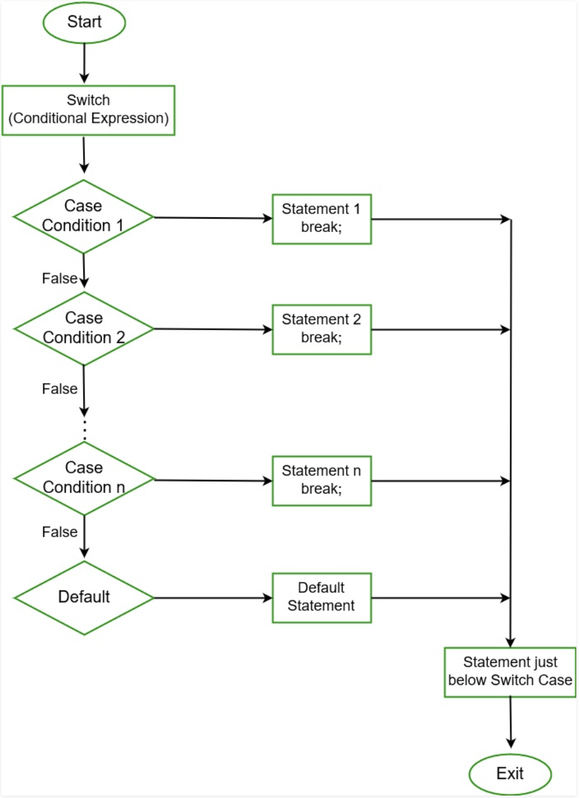

## Why

If we go all the way back to assembly then the only utilities we had were jumpTo statements and labels. In C new selection statements were introduced that form the basis for hundreds of languages today and allow us to describe things in statements that are much more readable and composable.

Selection statements enable you to branch to different sections of code, depending on one or more specified conditions. The components when concerning selection statements are if, else, switch and case.

## What

An if statement identifies which statement to run based on the value of a Boolean expression. In the following example, the bool variable condition is set to true and then checked in the if statement. Since the condition is true, the output is: “The variable is set to true.”. If the bool had been set to false then the else portion would have executed.

---

## How

```csharp
bool condition = true;

if (condition)
{
    Console.WriteLine("The variable is set to true.");
}
else
{
    Console.WriteLine("The variable is set to false.");
}
```

---
In C# the else-if statement is one of the most commonly used control flow statements. With if statements, you can tell the computer to make a choice by evaluating a Boolean expression (true or false) called condition. It allows you to tell the computer whether to run the code inside the block based on if the condition or set of conditions equates to true. Each Boolean expression can be independent of the others and can include any of the comparison and logical operators. An if statement can be extended by any number of else-if clauses to test more conditions. Each additional condition will only be tested if all previous conditions are false. Finally, you can use the else statement at the end to execute some code if none of the above conditions are true.

---

```csharp
// Check for a condition, if the condition is false, keep moving
if (condition)
{
    // your code will execute here if condition = true
}
else if (otherCondition)
{
    // your code will execute if condition = false & otherCondition = true
}
else
{
    // your code will execute if none of the above if/else-if statements are true
}

// Next statement in the program.

```

---
A switch is a selection statement that chooses a single case section to execute based on if the value passed in matches the case conditional. The switch statement is a control statement different from the if statement because it evaluates a single expression against a list of possible cases. The break statement passes control out of the switch. You can omit a break statement if two cases lead to the same action.



***Why do we use switch statements instead of if-else statements***

We use a switch statement instead of else-if statements because the if-else statement only works for a small number of logical evaluations of a value. If you use multiple else-if statements for a larger number of possible conditions then, it takes more time to write and also becomes more difficult to read.

***Important points to remember***

* In C#, duplicate case values are not allowed.

* The data type of the variable in the switch and value of a case must be of the same type.

* The value of a case must be a constant or a literal. Variables are not allowed.

* The break in a switch statement is used to terminate the current sequence.

* The default statement is optional and it can be used anywhere inside the switch statement

* Multiple default statements are not allowed.

```csharp
//How:
switch(expression)
{
  case x:
    // code block
    break;
  case y:
    // code block
    break;
  default:
    // code block
    break;
}
```

```csharp
//Example: Outputs "Thursday" (which is day 4)
int day = 4;
switch (day)
{
  case 0:
    Console.WriteLine("Sunday");
    break;
  case 1:
    Console.WriteLine("Monday");
    break;
  case 2:
    Console.WriteLine("Tuesday");
    break;
  case 3:
    Console.WriteLine("Wednesday");
    break;
  case 4:
    Console.WriteLine("Thursday");
    break;
  case 5:
    Console.WriteLine("Friday");
    break;
  case 6:
    Console.WriteLine("Saturday");
    break;
  }
```

***This is how it works:***

* The switch expression is evaluated once.

* The value of the expression is compared with the values of each case.

* If there is a match, the associated block of code is executed.

## Exercise

(if, if-else)

1. Initialize an integer to represent a favorite number and assign a value with a number of your choosing.

2. Create an if-statement that if the favorite number is below the initial value, print out “too low”.

3. Create an else-if statement that if the number is higher than the initial value, print out “too high”.

4. Create an else statement that prints out “Nevermind”.

(switch/case)

1. Declare a string variable to represent a subject and initialize that variable by giving it a value with a subject of your choosing.

2. Pass the string “subject” in the switch statement.

3. Create two different cases with a subject, print out which subject it is and break afterward.

4. Also, don’t forget a default case.

## Quiz

<https://docs.google.com/forms/d/15HMe9qZ6Kxh0DJdcpmJg8Dn-8buUQK2LhWNh1VPv468/edit>
