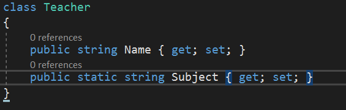
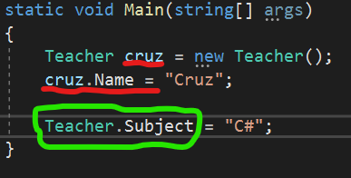
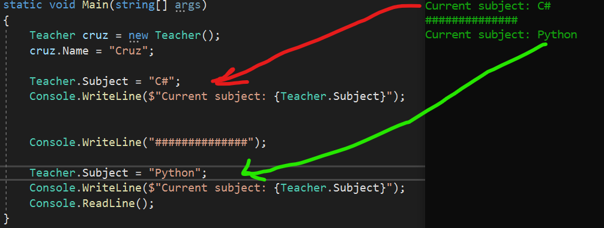
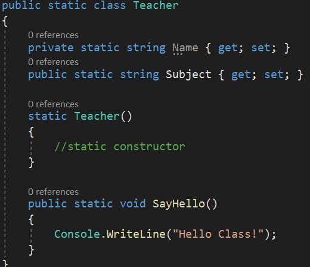
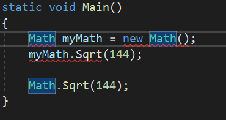

## Why

In code when we create an instance of a class we are allocating a certain amount of memory for that object to reference. We may have a class that performs a particular function or method in multiple parts in our code. As a programmer, you should always strive to have the most efficient and readable code as possible. Instead of instantiating the object and allocating the memory every time in our code just to invoke a couple of methods; we can use the static keyword.

---

## What

So what is static? Static simply means that when applied to a class member, it belongs to the type/class itself and not to the object instance. So what does that look like? Take a look at these 2 examples:

In the first picture, we see our custom class Teacher, it has 2 members one static and one non-static. The non-static field is accessed just as we normally would: we create an instance of the Teacher class with a type, name, and value; and access and assign a value to the property with cruz.Name = “Cruz” or (typename.PropertyName = value). Now let us look at the static property. We can see in the green circle in picture 2 that instead of using the object we created called cruz, we simply used our type (Teacher) and then used our Class Member Access Operator ( . ) to access the static property Subject and then assign it value or (`Teacher`.Subject = “C#”).

Properties are not the only thing that can be made static. Here is a list of items that can be static:

* Classes

* Fields or Variables

* Properties

* Methods

* Constructors

Something to take into consideration is when you declare a member static, there is only **ONE** copy of that member. If we look back at our second picture example, `Teacher`.Subject is assigned the value “C#” and it will always be that value until it is overridden. See the following example

---

## Static Classes

As listed above, classes can also be static. Static classes are sealed; meaning: you cannot have a child class that inherits from your static class. Moreover; the only other class a static class can inherit from is System.`Object`, like everything in .NET inherits from. When we declare a class as static, ***ALL MEMBERS MUST BE STATIC AS WELL!*** Below is an example of a static class:

A static class is a class that cannot be instantiated; or simply put: you do not use the `new` keyword to create a variable of the class type. Because there is no instance variable, you access the members of a static class by using the class name itself just like in our first example.

Classes that are static can have a **Parameterless** static constructor that you create otherwise it’ll use a default static constructor that gets called. The .NET Framework actually doesn’t know when it (the constructor) will get called but guarantees that it will be called once and only once sometime between the start of the program and before the first time the class is referenced.

---

## How

Now that we know that information, how do we put it into practice? Well, there are a few areas we can turn to for examples first. One example of using a static class and static class members is System.`Math`. If somewhere in our code we need to do more advanced math operations like getting the square root of something or sin, cos, and tan, we can call on the Math class to do those operations for us. From an efficiency standpoint, it doesn’t make sense to create a new instance of the Math class every time and then use the object to perform the calculations, we just want it to do the calculations and get on with the program. Since System.`Math` is static we do not have to do that see below the difference:

We can see it is much cleaner just calling `Math`.Sqrt() to do our calculation. Since there is only one copy of the Math class we aren’t creating a bunch of unnecessary objects all throughout our code anytime we want to use those methods. Obviously, we have red squiggles under the top example and that is because we tried to create an instance of a static class that we know isn’t allowed.

Another example of using a static class and static class methods, one we all should be pretty familiar with by now is System.`Console` i.e. `Console`.WriteLine() and `Console`.ReadLine(). We do not need to create a console object to just print something to the console, we just call the static method WriteLine() to do that for us.

---

## Exercises

1. Create a new console app called StaticExercise. Now create a static class called TempConverter. The class should have at least 2 methods, one called FahrenheitToCelsius(), the other CelsiusToFahrenheit(). Fill out those methods and call them in your Program.cs. Make sure they’re accurate!

2. Building on our car lot simulator project, create a CarLot class with a static field called numberOfCars. Have this number only increment when in our program we create a `new Car`. From there create 3 cars in the Main() and then each time you create a car, do a `Console`.WriteLine() printing the current number of cars in the car lot.

## Quiz

<https://docs.google.com/forms/d/13iv1B4ArU6XDwM7Ed9VNZOyceBhe4VUkHPOwmsh8bbs/edit>
