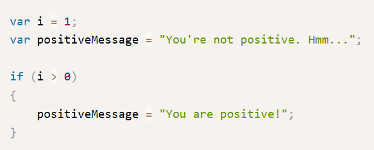
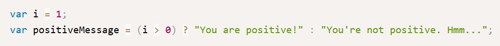
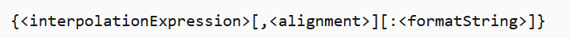
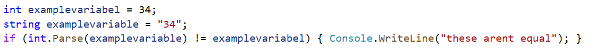
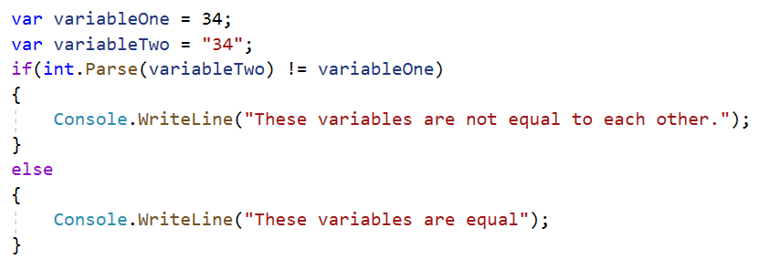
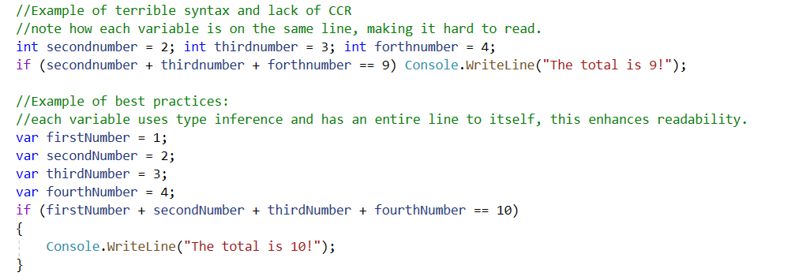
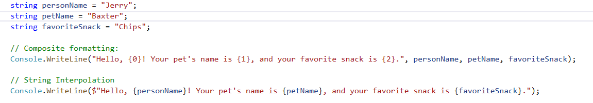

## Why

Writing code is just like writing a manual, or a recipe; it needs to be **readable** in order to be understood by other people; this may seem obvious, but due to the abstract nature of programming as a craft, and the size of the subject, core factors such as syntax often can be overlooked in the haste to explain many other important concepts.

Code written without proper syntax principles in mind is, more often than not, sloppy at best and incomprehensible at worst to anyone besides the person who wrote it. **In a perfect world, anyone should be able to read someone else’s code and be able to fully understand its purpose and function.**

Code that follows these guidelines are also far easier to debug and test for errors in comparison to code that doesn’t.

---

## History

C# was developed by Microsoft within its .NET framework initiative and was designed by Anders Hejlsberg. C# is a general-purpose, object-oriented based programming language; in an object-oriented language, the syntax is a major part of the composition of code, affecting readability and how the code actually functions when compiled and executed.

---

## What

Syntax is the grammar for programming.

These are **syntax principles** that result in simple code with a refined purpose.

* **CCR:** an acronym that stands for Clear, Concise, Readable:

  * **Clear:** Code should have a clear purpose and meaning.

  * **Concise:** Code should not be unnecessarily long or verbose

  * **Readable:** Code should be easy to read and understand

* **Best Practices:** this is syntax that is not required, but is considered the best thing to do. For example, **using type inference with the var keyword** is considered best practice.

* **Syntax Sugar:** this is syntax that is not required and not necessarily best practice, but merely makes coding more convenient or concise.  

  * In a nutshell, this is just syntax which allows writing more with less.  While generally good, If taken to extremes this can reduce readability.  Remember, code is for humans!

* **Code Smell:** any indicator in a program that a potentially deep-seated issue is present. Is usually subjective and depends on factors including the particular language and experience.

---

## How

***Type Inference vs. Explicit typing***

**C#** is a **strongly** and **statically** typed language, meaning that every variable must have a **type** in order to compile and that once a type is given, it cannot change. Declaring a type can be done in one of two ways, through **explicitly** typing, or **inferred** typing:

**Explicit Typing:**

```csharp
string firstname = "John";
```

Explicitly typing, as the name suggests, involves specifically naming what each variable’s type is. The variable **firstName** has a type of `string` because it was intentionally given the type of string by the author.

**Inferred typing:**

```csharp
var firstname = "John";
```

Inferred typing is where the compiler defines the variable’s type by looking at what the variable’s value is and inferring what the most probable type is. The variable **firstName** has a type of `var`, meaning that when the compiler runs, it will assign a type depending on **firstName’s** value.

With both explicit typing and inferred typing, once a type has been determined, it cannot change later, which is why in the example below, the **firstName** variable’s value of 32 has a red error message, as it’s type has been determined to be something else.

```csharp
firstname = "32";
```

With explicit typing, the **firstName** variable’s type is `string`, meaning that only a value that is a `string` can be assigned to **firstName**.

With inferred typing, the **firstName** variable’s type is `var`, but since the value assigned to **firstName** is the name “John”, the compiler determined that the appropriate type would be a `string`.

---

***Syntax Sugar: Inline If/Ternary Operator***

An excellent example of syntax sugar is the Inline If, also called a ternary operator. It is essentially a normal If-statement but in a more condensed format.

An Inline If has a few parts, following this format:



Option 1: Normal if statement



Option 2: Inline If/Ternary Operator



Option 2 is clear and readable like Option 1, but Option 2 is far shorter and more concise.

***Syntax Sugar: String Interpolation***

C# string interpolation is a method of concatenating, formatting, and manipulating the object type known as ”**strings**”. String interpolation provides a shorter, more readable, and more convenient syntax to create formatted strings; The **$** symbol is used to identify an interpolated string.

An Interpolated String has a few parts, following this format:


**Example:**



Both lines of code use the same variables and produce the same result, but the line using String Interpolation is shorter and is easier to understand.

---

## Exercise

***Code Smell:***

Pick the better code:



***CCR/Best practices exercise:***

Example:



***String interpolation exercies***

Example:



Given the following code, change the code to implement inferred typing, interpolation, and the ternary operator.

```csharp
int answer = 4;
string response;

if (answer < 9) ? $”{
{
  response = answer + " is less than nine";
}
else
{
  response = answer + “greater than or equal to nine”;
}
```

[Teacher's answer](https://docs.google.com/document/d/1fC87Ri0z4cm5vxxokRi9lE_7Y77ZraWLhHgCQaoKgrw/edit?usp=sharing)

## Quiz

<https://docs.google.com/forms/d/1YTgKAw0rp4snTno3HCJGRdIaqTHc2CiXByON0tnoPcA/edit>

## References

* <https://www.w3schools.com/cs/cs_syntax.asp>

* <https://docs.microsoft.com/en-us/dotnet/csharp/language-reference/tokens/interpolated>

* <https://www.c-sharpcorner.com/blogs/history-of-c-sharp-programming-language>

* <https://www.c-sharpcorner.com/article/understanding-string-interpolation-in-c-sharp/>

* <https://docs.microsoft.com/en-us/dotnet/csharp/tutorials/string-interpolation>

* <https://www.dotnetperls.com/string-interpolation>
