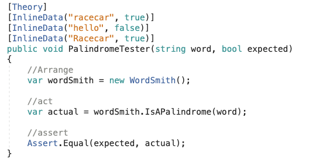

## Why

We cover Test Driven Development because of the many advantages it gives to programmers.  It drives the design process of our code and helps with reducing bugs in the code we write.  It also makes the functionality of our code clear and simple while being easier to maintain and understand.

Many credit Kent Beck for inventing TDD, but Kent himself says he merely rediscovered it.  One of the earliest references of TDD can be found from 1957 in the Digital Computer Programming D.D. McCracken, so the process itself is not something new.  The original description of TDD stated that you take the input tape, manually type in the output tape you expect, then program until the actual output tape matches the expected output.

<https://arialdomartini.wordpress.com/2012/07/20/you-wont-believe-how-old-tdd-is/>

<http://blog.jphpsf.com/2012/09/30/OMG-test-driven-development-actually-works>

<https://jrebel.com/rebellabs/if-and-when-you-should-use-test-driven-development/>

---

## What

***Test Driven Development*** - Is a process that relies on the repetition of a very short development cycle:

Requirements are turned into very specific test cases, then the software is improved so that the tests pass. This is opposed to software development that allows software to be added that is not proven to meet requirements.

Overall, ***TDD is a process in which we write our tests first and those tests are used to drive the design of our code or application***

**Advantages of Test Driven Development:**

* Bugs in your code can be avoided sooner rather than later

* The intentions of your functionality are made clear

* It encourages decoupling - which allows changes to be made to one thing without affecting another thing

* You accumulate tests over time that can be quickly run without the time consuming manual tests

---

***Unit Testing***

Consists of tiny testable parts of a program independently tested for expected functionality.  Unit testing plays an important role in Test Driven Development. The purpose is to validate that each unit of the software performs as designed. ***A unit is the smallest testable part of any software.***

**Creating a Unit Test contains the following segments:**

1. Arrange:  This is where we prepare the code in order to call the method you need to test. For example, we may need to instantiate an instance of the class that will contain the code we are testing.

2. Act: This is where we actually call the method we want to test. Simply put, we need to call what we want to test

3. Assert: Check against a constant (check against what is expected). Verify that the code we wrote behaves as expected

---

**Red, Green, Refactor Process:**

Here is the process we follow when writing Unit Tests:

Red - We write the test and then watch it fail (it fails because the code needed in order for the test to pass hasn’t been written yet!).  We create a test that will fail on purpose so that we know with a degree of confidence that our tests will fail when expected to - making it red

Green - Now we write code in our software or application so that our test will pass - making it green

Refactor - Here we change the passing code we wrote (the code that made our test pass) without changing the behavior of the code itself. We want our code to still behave as we expect.  This allows us to improve code readability and possibly reduce complexity.  

**Tools for Testing:**

xUnit - A unit testing tool for the .NET Framework that we will be using in this class

[Adding a xUnit Project](https://docs.google.com/document/d/16oEgosdUn0x-yrXlTDcmH3_ipTmjxDc0HSyiWA6gNaM/edit?usp=sharing)

---

**xUnit syntax:**

`[Fact]`

xUnit uses the `[Fact]` attribute to denote a parameterless unit test, which tests invariants in your code

`[Theory]`

`[InlineData()]`

In contrast, the `[Theory]` attribute denotes a parameterized test that is true for a subset of data. That data can be supplied in a number of ways, but the most common is with an `[InlineData]` attribute.

---

## How

***Let’s say I want to write a function that calculates how much an employee makes per hour given their annual salary amount.***

First, I would write my unit test - which would fail -RED-  because I need to write the code for my function before it can pass

Next, I would define the function, I can name this function HourlyPay, and keep writing the code for that function until my test passes -GREEN-

Finally, I could refactor my code for refinement

---

## Exercise

* ***Lets create a Unit Test for a method that tells us if a word is a Palindrome.  In our unit test we will need to Arrange, Act, and Assert and follow the Red, Green, Refactor process***

  * We will create a new .NET Core Console application and add a xUnit project to the application

  * In your code, you will create a method (we can name this method IsAPalindrome) that will take a parameter of type string and returns a value of type bool.  If the given input is a palindrome – return true, else return false.

<https://github.com/mvdoyle/PalindromeExercise>

* Fork this repository and complete the exercise:
  
  * <https://github.com/nrice41593/UnitTestingExercise>

## Quiz

<https://drive.google.com/open?id=1YoQVvyEP-1xUaD8kiPtvsNm6w_fnqvWTYfL6Kxd59Mk>
