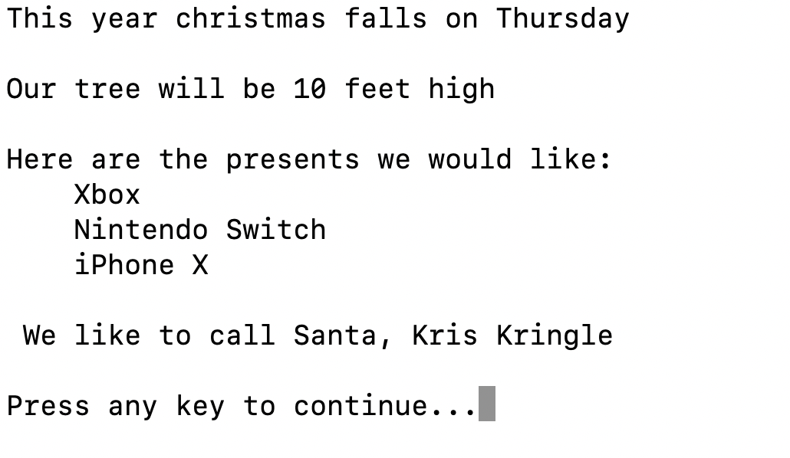

## Why

We teach Value and Reference types because C# is a strongly and statically typed object oriented programming language.  **Strongly** - meaning that once a variable’s type is declared, it cannot change, although you can change its value; **Statically** - meaning that every variable must have a type at compile time.  So you can see that types and knowing how they function are pretty important.  In this lesson we’ll cover what the types are, how they function, and how we will utilize them as we begin programming in C#

## What

**Value Types:**
Stored in memory in a location called the stack.

1. bool
2. char
3. int
4. decimal
5. enum

...more listed on the types page ---> <https://learn.truecoders.io/csharp/types/>

**Value types store the actual data rather than a reference to it.**

**Value Types are not automatically nullable.**  While reference types automatically support being set to null, value types require an actual value. When you need to assign null to a value type, you employ the "nullable" of that type. A value type, followed by a ? is shorthand syntax for nullable:

example) int? myInteger = null;

**Signed vs Unsigned:**
**Signed:** A signed integer is one with either a plus or minus sign  
in front. That is it can be either positive or negative.

**Unsigned:** integer is assumed to be positive.

Reference Types:

* String
* Array
* **These are automatically nullable**

A **reference type** is set by storing the actual data (object) in memory and storing a reference to the object within the variable. Reference types in C# automatically support being set to null.

## Reference vs Value Types

* **Value types** actually hold values. Assigning one value type to another literally copies the value.

  * Examples include: structs, enums, Booleans, and numeric types.

* **Reference types** are objects that store references to the actual data.  

  * Examples include: classes, interfaces, objects, and string.

The **Stack** is used for static memory allocation.  This is where Value Types are stored.

It utilizes a LAST IN, FIRST OUT procedure.

* So the last item that enters the stack is the first item that leaves.


* The **Heap** is used for dynamic memory allocation.  This is where Reference types are stored.
  * Elements **can be used in any order** for the heap.
  * The heap is used for custom obects that may require additional memory during the runtime of the program.

The **Queue** is a **FIRST IN, FIRST OUT** collection of elements where the first element that goes into a queue is the first element that comes out.

## How

With a **value type**, when you copy a variable you create a clone of the actual value.
Let's see how this works with an int.

```csharp
var a = 1; // value type int
var b = a; // clone the value of `a`

a = 2; // Change the contained value of `a`

// Now a equals 2 && b equals 1

```

With a **reference type**, when you copy a variable you create a clone of the reference to the same actual data value:

Let's see how this works with a class called Point:

```csharp
public class Point
{
     public int X;
     public int Y;
}

Point p1 = new Point();
p1.X = 7

Point p2 = p1; // Copies p1 reference

Console.WriteLine(p1.X); //prints 7
Console.WriteLine(p2.X); //prints 7


p1.X = 9; //Change p1.X
Console.WriteLine(p1.X); //prints 9
Console.WriteLine(p2.X); //prints 9
```

Notice in the above code that p1 and p2 are two references that point to the same object

## Exercise

**The following assignment is a console application:**

**Fork the exercise <https://github.com/mvdoyle/ChristmasWithTypes>  and complete each ***TODO*** in the project - This will remove the errors currently residing in the project.  In this exercise you will get some experience with reference and value types, enums, arrays, strings, and making value types nullable.  To complete this assignment, your console should output something like this:**



## Quiz

<https://drive.google.com/open?id=1T4V1Gnww4i1ARS89K9VwMqNHkc5gnYDJg7bZyHykGGg>

## Sources

<https://www.c-sharpcorner.com/UploadFile/vikie4u/type-safety-in-net/>
