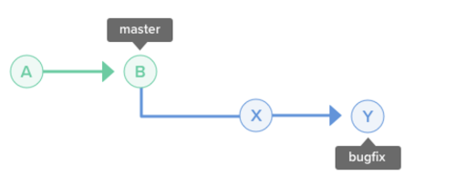

## Why

We teach conflict resolution in git because sometimes merging won’t be so simple.  This is especially true when we start collaborating with others, whether in the community or in the workplace.  Knowing how to resolve merge conflicts and utilizing the full power of git will give you a great advantage in the workplace and will allow your workflow to achieve new heights.

---

## What

**Merge Conflict:** A conflict occurs when there are two changes in the same line or set of lines in two different commits. It’s important to note that git doesn’t know how to code in C#.  Git doesn’t know what to do when you have two edits of the same line, so git will mark the conflict and allow the user to decide which edit to pick or what changes to make.

**In the situation below, there are two branches: a "bugfix" branch with a few commits coming off the "master" branch.**

In this case, merging "bugfix" back into "master" is not much of an issue. That's because the state of "master" has not changed since "bugfix" was created. Git will merge this by moving the "master" position to the latest position of "bugfix". This merge is called a **"fast-forward"** since the possibility of a conflict cannot exist.

In the example below, however, "master" has been updated several times since "bugfix" was branched out. The changes from "bugfix" and "master" need to be combined when a merge is executed on these two branches.

")

For this sort of merge, a "merge commit" will be created and the "master" position will be updated to the newly created merge commit.

")

## Resolve Merge Conflicts

* **Abort:** stop the process
  * git merge --abort

* **Resolve the Conflict Manually:** going through the code and making edits
  * **git diff --color-words master..branch1 filename.txt**
    * **--OR--**
  * **git show --color-words**

* Take out the git markers and choose what changes we want.
  * **git status m**
  * **git add filename.txt**
  * **git status**
  * **git commit**
DONE

BONUS: git log --graph --all --online --decorate

")

* **Merge Tool:**
  * git help merge-tool
    * Example tool: <http://kdiff3.sourceforge.net/>

## Git Documentation

* <https://git-scm.com/book/en/v2>

* <https://backlog.com/git-tutorial/using-branches/git-switch-branches/>

---

## How

Usually, a merge conflict can arise when the master has been updated since you created your new branch (based off master).  Maybe someone edited the same lines you were intending to edit without your knowledge.  You don’t have to throw all of your work away!  We can simply resolve the conflict points and get your work into the master branch!

We can show this merge conflict from my git repository:
<https://github.com/mvdoyle/MergeConflictExercise>

* **Resolve the conflict manually:**
  * **Look at master branch**
  * **Git checkout newBranch**
  * **Inspect the newBranch**
  * **Git checkout master ← switch back to master**
  * **Git merge newBranch**
  * **Resolve the merge conflict**

* Take out the git markers and choose what changes we want.
  * **git status m**
  * **git add filename.txt**
  * **git status**
  * **git commit**
DONE

BONUS:
git log --graph --all --online --decorate

* git diff --color-words master..branch1 filename.txt
* --OR--
* git show --color-words

")

---

## Exercise

* **Interactive Tutorial:**
  *<https://www.katacoda.com/courses/git> <--- complete scenarios 5

* **Topics covered in the tutorial:**
  * fixing merge conflicts (always a trouble point);

* **Show the pizza algorithm file from the previous merging exercise:  create a new branch and make edits to that branch and commit.  Switch to master branch, make changes to the same lines and commit to create a conflict.**

* **Fork and Clone this repository:**
  * **Git checkout newBranch**
  * **Merge newBranch into master and fix the merge conflict**
  * <https://github.com/mvdoyle/MergeConflictExercise>

## Quiz

<https://drive.google.com/open?id=1zrwppY_Js4eIFif-XfuaZDxp0mYRiQ2DGwWMLGrk9to>
