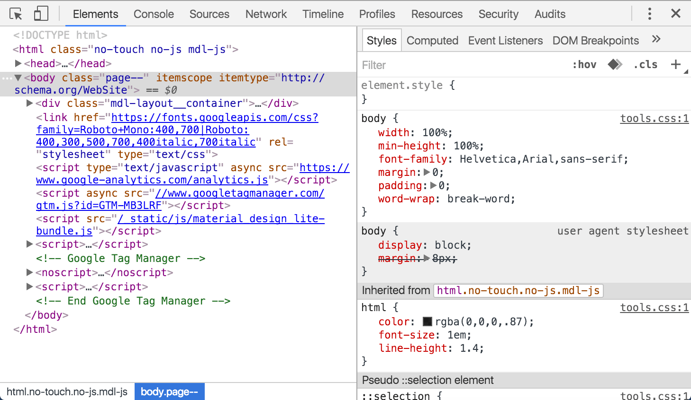
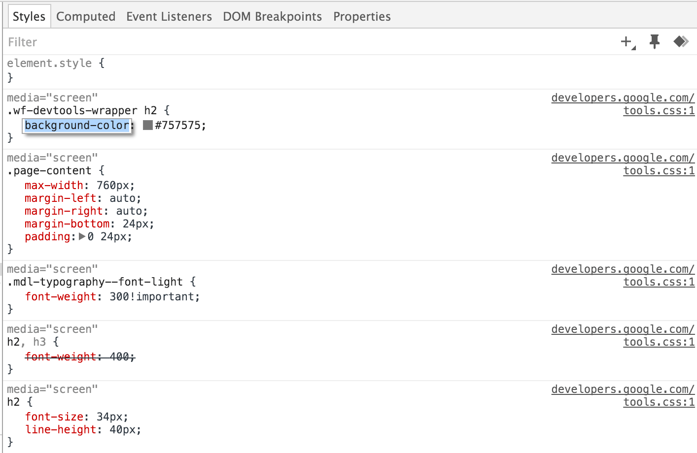
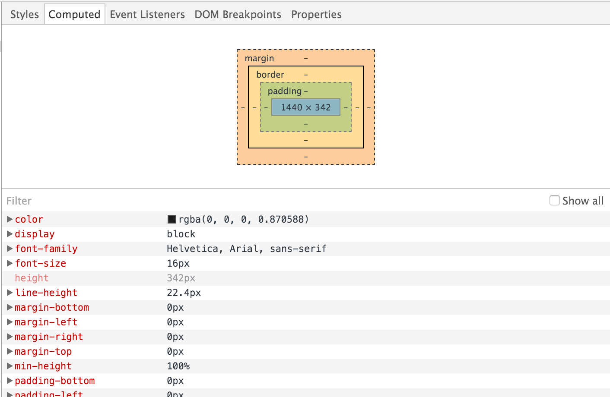
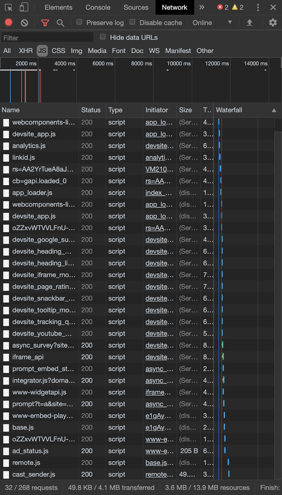
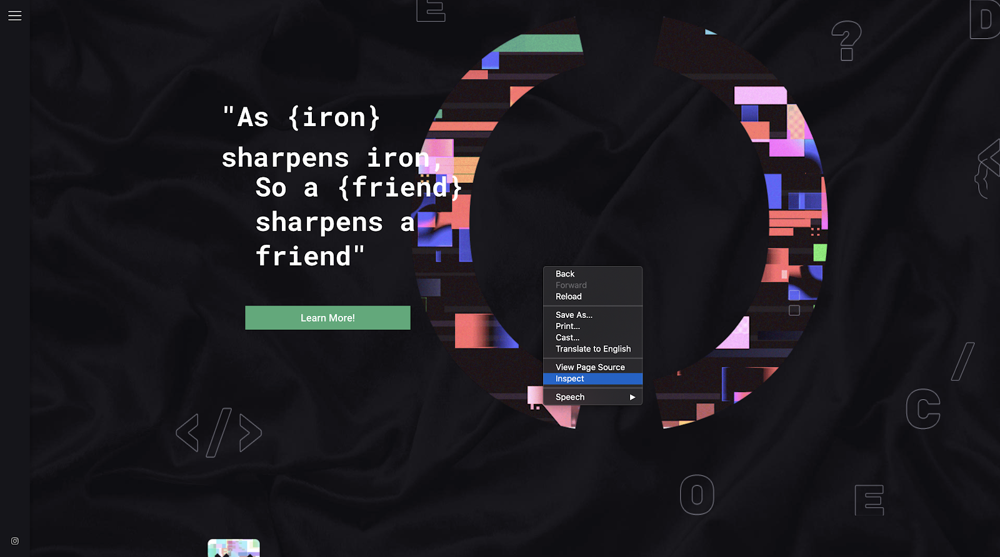
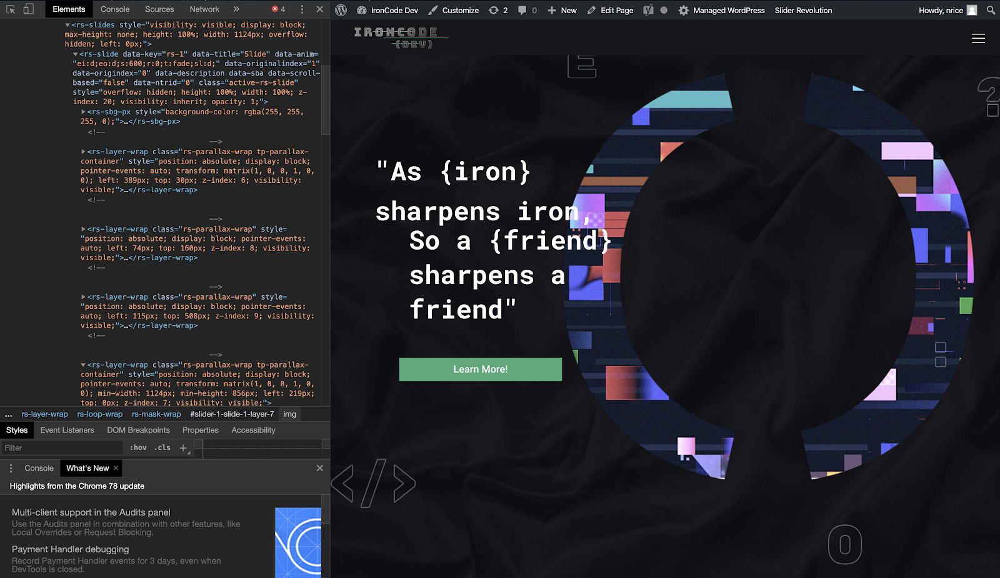

## Why

Google’s popular web browser, Chrome, has developer tools built right in. It’s a set of tools made for web-authoring and debugging. The Chrome Developer Tools (known as DevTools) give developers access to the internal workings of the web browser and web apps. Using Chrome DevTools you can know the styles that are used, the size of the images, the scripts that are used, etc. You can debug and know what errors exist on the page. You can even toggle styles on or off, or change them completely, to see what effect it has on your website.

---

## What

Though the way you may access the Chrome Inspector is different, Visual Studio and Inspector are extremely similar. Things like a Console, both allow breakpoints, watches, and have a call stack window.

There are many ways to open DevTools, because different users want quick access to different parts of the DevTools UI:

* When you want to work with the DOM or CSS, right-click an element on the page and select Inspect to jump into the Elements panel. Or press Command+Option+C (Mac) or Control+Shift+C (Windows, Linux, Chrome OS).

* When you want to see logged messages or run JavaScript, press Command+Option+J (Mac) or Control+Shift+J (Windows, Linux, Chrome OS) to jump straight into the Console panel.

***Live-edit a DOM node***

The DOM tree view shows the current state of the tree; it may not match the HTML that was originally loaded for different reasons. For example, you can modify the DOM tree using JavaScript; the browser engine can try to correct invalid author markup and produce an unexpected DOM.

***Live-edit a style***

* Live-edit style property names and values in the Styles pane. All styles are editable, except the ones that are greyed out (as is the case with user agent stylesheets).

* To edit a name or value, click on it, make your changes, and press Tab or Enter to save the change.

***Examine and edit box model parameters***

* Examine and edit the current element's box model parameters using the **Computed pane.** All values in the box model are editable, just click on them.

***View local changes***

To view a history of live-edits made to your page:

1. In the Styles pane, click on the file that you modified. DevTools takes you to the Sources panel.

2. Right-click on the file.

3. Select Local modifications.

To explore the changes made:

* Expand top-level file names to view the time  a modification occurred.

* Expand second-level items to view a diff (before and after) corresponding to the modification. A line with a pink background signifies a removal while a line with a green background signifies an addition.

***Network***

When to use the Network panel

In general, use the Network panel when you need to make sure that resources are being downloaded or uploaded as expected. The most common use cases for the Network panel are:

* Making sure that resources are actually being uploaded or downloaded at all.

* Inspecting the properties of an individual resource, such as its HTTP headers, content, size, and so on.

If you're looking for ways to improve page load performance, don't start with the Network panel. There are many types of load performance issues that aren't related to network activity. Start with the Audits panel because it gives you targeted suggestions on how to improve your page.

***Log network activity***

To view the network activity that a page causes

1. Reload the page. The Network panel logs all network activity in the **Network Log.**

2. So long as you've got DevTools open, it will record network activity in the **Network Log.** To demonstrate this, first look at the bottom of the Network Log and make a mental note of the last activity.

3. Now, click the **Get Data** button in the demo.

4. Look at the bottom of the **Network Log** again. There's a new resource called getstarted.json. Clicking the **Get Data** button caused the page to request this file.

**Status.** The HTTP response code.

* **Type.** The resource type.

* **Initiator.** What caused a resource to be requested. Clicking a link in the Initiator column takes you to the source code that caused the request.

* **Time.** How long the request took.

* **Waterfall.** A graphical representation of the different stages of the request. Hover over a Waterfall to see a breakdown.

***Application***

Open the Cookies pane

1. [Open Chrome DevTools](https://developers.google.com/web/tools/chrome-devtools/open)

2. Click the **Application** tab to open the **Application** panel. The **Manifest** pane will probably open.

3. Under **Storage** expand **Cookies**, then select an origin.

***Fields***

The **Cookies** table contains the following fields:

* **Name.** The cookie's name.

* **Value.** The cookie's value.

* **Domain.** The hosts that are allowed to receive the cookie. See Scope of cookies.

* **Path.** The URL that must exist in the requested URL in order to send the Cookie header. See Scope of cookies.

* **Expires / Max-Age.** The cookie's expiration date or maximum age. [See Permanent cookies.](https://developer.mozilla.org/en-US/docs/Web/HTTP/Cookies#Permanent_cookies) For [session cookies](https://developer.mozilla.org/en-US/docs/Web/HTTP/Cookies#Session_cookies) this value is always Session.

* **Size.** The cookie's size, in bytes.

* **HTTP.** If true, this field indicates that the cookie should only be used over HTTP, and JavaScript modification is not allowed. [See HttpOnly cookies.](https://developer.mozilla.org/en-US/docs/Web/HTTP/Cookies#Secure_and_HttpOnly_cookies)

* **Secure.** If true, this field indicates that the cookie can only be sent to the server over a secure HTTPS connection. [See Secure cookies.](https://developer.mozilla.org/en-US/docs/Web/HTTP/Cookies#Secure_and_HttpOnly_cookies)

* **SameSite.** Contains strict or lax if the cookie is using the experimental [SameSite](https://developer.mozilla.org/en-US/docs/Web/HTTP/Cookies#SameSite_cookies) attribute.

---

## How

While this can be applied to any website, we’ll go to a Website called <http://ironcodedev.com/>

Here we can right click anywhere on the page and click Inspect

We then can see the Chrome DevTools with Elements already selected:

Then, We can edit the CSS temporarily and see the changes live to webpage

---

***Exercise With Quiz***

* Use the Exercise Github project to answer questions in the quiz

* Students will need to fork the project from GitHub

## Exercise

<https://github.com/nrice41593/ASP.NETPractice>

## Quiz

<https://docs.google.com/forms/d/1p2wldsj5HgLFcGsOPMN7ByGzqR8_9dDad64pLzPtjJg/edit>
